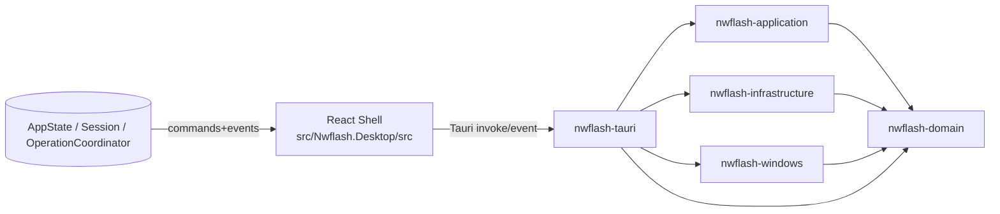

# 奶蛙Flash（Tauri/Rust 迁移）架构快照（更新至 2026-08-20）

## Windows release boundary

`scripts/Publish-TauriRelease.ps1` 默认生成受保护、已签名的 Tauri NSIS 发布物，并在发布前运行 Rust、前端、原生 E2E、安装验证和清单校验；`scripts/Verify-TauriRelease.ps1` 读取并核验发布树及 SHA-256 清单。只有显式传入 `-DevelopmentUnsigned` 才生成未签名开发暂存。每用户安装器嵌入 WebView2 bootstrapper。当前发布白名单随包提供 platform-tools、Vivo 驱动、root-tools、完整 scrcpy、KSU/KernelSU APK 和 payload_dumper。

> 本文档记录在 `5.3codex` 流水线下，当前以源码为准的 Rust 迁移架构。用于替代新增需求前的实现边界核对，确保不引入无依据的行为变更。

## 1. 迁移目标边界

- 可见品牌名固定：**奶蛙Flash**。
- 代码名与技术术语：**NWflash**，`X-Nwflash-Version` 仍作为 API 版本头语义传递给 Cloudflare。
- 设备刷写与文件传输仍采用进程参数化执行，不允许拼接 shell 命令字符串。
- 只实现会话门禁、版本检查、快速刷写预检与命令执行闭环（当前阶段），暂不扩展文件系统/网络能力到前端。
- 不修改 `cloudflare/**`（外部后端契约在独立仓库目录维护）。

## 2. 代码结构与层次

当前 workspace 成员：
- `crates/nwflash-domain`：纯模型与错误分类（无外部 IO）
- `crates/nwflash-application`：会话、协调器、用例（刷写/传输 DTO、命令规范）
- `crates/nwflash-infrastructure`：Cloudflare 客户端、在线版本检查、operation log 存储
- `crates/nwflash-windows`：跨进程执行、platform tools 组装、分区/设备命令参数对象
- `crates/nwflash-tauri`：Tauri 命令、事件、应用生命周期状态桥接
- `src-tauri/src/main.rs`：唯一的 Tauri 二进制宿主；它由 `src-tauri/build.rs` 提供上下文生成所需的构建环境。命令桥 crate 仅作为库参与链接，不生成第二个二进制目标。
- `src`：React 壳体与页面组件
- 当前窗口壳体布局已完成三栏化：`160px` 侧边栏 / `auto` 主内容 / `286px` 右侧状态区。

## 3. 核心运行时链路

1. **启动**：`App.tsx` 在存在 Tauri 环境时，优先执行 `version_check`，拦截 `update_required/force_update`。
2. **会话恢复**：成功后查询 `session_state` 与 `auth_validate_token`，恢复登录态并触发 `session_start`。
3. **事件驱动**：`operation:snapshot` 进入前端后在右侧状态区展示统一进度；`session:update-required` 与 `session:force-exit` 触发立即退回未登录态。
4. **命令执行**：
   - `QuickFlashService`/`FileTransferService` 生成 `CommandSpec[]` 或单 `CommandSpec`；
   - `nwflash-tauri` 命令通过 `run_command_with_cancel` 执行；
   - 执行中每轮轮询 `CancellationToken`，退出时会触发 `UserCancelled`；
   - Windows 环境使用 `taskkill /F /T /PID` 清理进程树。

## 4. 已完成功能切片（最小闭环）

- **Task4（接口面）**：刷写预检与传输命令 DTO 可生成、参数边界验证覆盖。
- **Task4（执行闭环）**：
  - `quick_flash_execute_boot_image` / `quick_flash_execute_preset_image` / `quick_flash_execute_firmware_artifact` / `quick_flash_execute_prepared_dual_slot_preset`
  - `file_transfer_run_pull_command`
  - `file_transfer_run_push_command`
- **Task5（在线状态页）**：
  - 新增 Tauri `online_sessions` 命令，基于会话 token 调用 `CloudflareClient::get_online`；
  - `OnlineStatusPage` 改为真实加载与渲染在线会话列表（含当前会话标记与错误空态处理），并按 5 秒轮询刷新。
- **固件提取与 VIVO 线刷**：
  - ROM URL 不是前端 DTO，也没有通用 `firmware_resolve` command。`safe_flash_prepare_online` 在 Rust 内部从当前 ADB 设备派生 PD/版本，并用内存 session token 解析 ROM，再把结果直接交给受控准备流程；前端只提交来源意图和刷写选项。
  - 已注册的 Safe Flash command 为 `safe_flash_prepare_online`、`safe_flash_prepare_local_source`、`safe_flash_prepare_local_directory`、`safe_flash_execute_prepared` 与 `safe_flash_cancel_prepared`。不存在 `safe_flash_prepare_commands` 或 `safe_flash_execute_commands`。
  - 预检成功只返回不透明 `session_id`、来源标签、总分区数、可刷写分区数、块式 OTA 标志和确认要求。ROM URL、本地路径和镜像路径只存在 Rust 内存中的 `SafeFlashRuntime` capability；执行命令可在 Rust 瞬态计划中携带当前 serial，但它不是 capability 的设备身份绑定字段，且实际命令目标始终按当前唯一设备快照取得。
- **Task5（可视刷写页）**：
  - `LineFlashPage` 现对应 WPF 分区工作区，复用已经注册的 `partitions_*` command；
  - 前端仅提交已选择的分区名称、native dialog 返回的镜像/备份目录，以及 `Automatic`、`AdbRoot`、`Fastboot` 三值封闭枚举；不能提交设备路径、serial、命令或任意 transport 文本。
- **会话与版本门禁**：
  - `auth_login` / `auth_logout` / `auth_validate_token`
  - `session_start` / `session_stop` / `session_state`
  - `version_check`
- **操作可见性**：
  - 统一进度事件 `operation:snapshot`
- 操作日志命令：`operation_logs_snapshot` 读取内存快照；`operation_logs_clear` 只清除该内存快照，不删除持久化日志文件。前端日志面板对非法快照安全回退为空态。

## 5. 安全与约束

- 后端会话令牌仅在内存流转，不落地至前端持久化存储。
- 取消语义可中断外部进程树，不依赖仅取消等待线程。
- 进度与日志更新遵循 `OperationCoordinator` 约束，避免并发任务叠加。

## 6. 证据与验收命令（当前阶段）

- Rust：
  - `cargo test -p nwflash-windows --lib`
  - `cargo test -p nwflash-application --test quick_flash --test file_transfer --test operation_coordinator --test session_lifecycle`
  - `cargo test -p nwflash-tauri --lib`
  - `cargo test --manifest-path src-tauri/Cargo.toml --test build_smoke`
- 前端：
  - `npm --prefix src/Nwflash.Desktop run test -- AppSessionLifecycle.test.tsx AppShell test AppSessionAuthFlow.test.tsx OperationLogPage.test.tsx QuickFlashPage.test.tsx FileManagerPage.test.tsx`
  - `npm --prefix src/Nwflash.Desktop run test -- OnlineStatusPage.test.tsx`
  - `npm --prefix src/Nwflash.Desktop run test -- FirmwareExtractPage.test.tsx`
  - `npm --prefix src/Nwflash.Desktop run test -- LineFlashPage.test.tsx`
  - `npm --prefix src/Nwflash.Desktop run test -- SafeFlashPage.test.tsx`
  - `npm --prefix src/Nwflash.Desktop run test -- OverviewPage.test.tsx MirrorPage.test.tsx RootPage.test.tsx SoftwarePage.test.tsx`

## 6.1 Task 16 E2E IPC Mock Boundary

- `npm run build:e2e` sets `VITE_NWFLASH_WDIO_E2E=true`. Only under that explicit build flag does Vite alias `@tauri-apps/api/core` to `src/test/tauri-core.wdio.ts` and `@tauri-apps/api/event` to `src/test/tauri-event.wdio.ts`.
- The E2E-only module re-exports the normal Tauri core API and preserves the `invoke<T>(command, args?, options?)` signature. Its `invoke` checks WDIO's `window.__wdio_mocks__` registry first, then delegates to the real Tauri module.
- This is necessary because page modules import `invoke` directly; patching `window.__TAURI__.core.invoke` alone cannot change an already-bound ESM import. The compatibility boundary lets embedded WDIO tests mock those direct imports without changing release runtime behavior.
- `tauri-event.wdio.ts` implements only the Tauri `listen`/unlisten lifecycle needed by the React app. It exposes `window.__nwflash_wdio_emit_event__` solely for embedded WDIO assertions to deliver an event to registered listeners; it neither mocks Rust commands nor enters the production bundle. These assertions cover React handling of the production DTO shape, but do not prove delivery from Rust `app_handle.emit` through the native Tauri event transport; that transport remains a separate residual risk because WDIO 1.3.0's embedded event envelope is currently defective.
- WDIO's `window.__wdio_mocks__` is document-scoped. `specs/direct-mock-bridge.ts` is a Mocha root hook that runs after the WDIO service hook and before each spec's own setup. It uses WebDriver script execution to register fixed resolved/rejected DTOs directly in that registry; it does not call `plugin:wdio|execute`, whose embedded result-event transport serializes null callback IDs on this Windows/WebView2 stack.
- Each case first clears and installs its own command responses. When a prior case intentionally leaves the logout control disabled by a busy operation, `prepareE2eLogin` refreshes only to the E2E build's signed-out bootstrap fixture, then re-registers its responses. No production route performs this reset.
- `wdio.conf.ts` is the embedded native interaction gate. It loads the direct mock root hook while preserving the actual Tauri executable, WebView2 window and DOM interaction path. `wdio.visual.conf.ts` builds the production frontend and runs only `visual-baseline.e2e.ts`; it cannot run interaction specs that require the E2E-only aliases. This separation verifies the release bundle excludes the test bridge while preserving native interaction coverage.
- `e2e-tests/package.json` runs `pretest:native` before every `test:native` invocation. The production browser visual build intentionally overwrites `dist`; rebuilding the E2E alias first prevents a later native test from silently using the production IPC import and falling back to WDIO's defective embedded mock transport.
- `wdio.conf.ts` constrains both the runner and its Tauri capability to one instance. The embedded provider cannot safely publish the plugin's internal result events from multiple desktop workers on this Windows/WebView2 stack; specs are intentionally serialized so the direct E2E mock registry remains document-local and deterministic.
- The native embedded configuration keeps both `captureBackendLogs` and `captureFrontendLogs` enabled. The direct mock bridge avoids the provider's result-event mock path while preserving stdout and WebView console forwarding to WDIO. The provider may still emit its post-session `Failed to clear mock store: A sessionId is required` warning after the session has ended; it is external teardown output, not an application command result.
- Normal `npm run build` does not install either alias or bundle either E2E compatibility module. It continues to import the native `@tauri-apps/api/core` and `@tauri-apps/api/event` modules directly.

## 6.2 登录窗口与视觉验收边界（2026-08-17）

- 未登录时 `App` 只渲染 `LoginScreen`，不创建主壳体或导航；登录成功后才恢复三栏主窗口。该边界与 WPF `App.xaml.cs` 中先模态 `LoginWindow`、成功后创建 `MainWindow` 的生命周期一致。
- Tauri 初始窗口和未登录客户区为 `400x564`，且不可调整大小；登录后 React 通过 `getCurrentWindow()` 切换到 WPF 主窗口的 `1240x700` 并恢复可调整大小。浏览器视觉运行不具备窗口 IPC，窗口同步只在有可调用窗口 API 时生效并安全跳过。
- 登录卡固定为 `352x516`，使用 WPF 的 `logo.jpg` 作为打包资产，保留关闭按钮、密码可见性按钮、中文文案和字段顺序。前端不保存 token。
- E2E 专用 core bridge 在 WDIO mock 优先级之后为 `version_check` 和 `session_state` 提供允许版本/无 token 的启动 fixture，以取得可重复的空闲登录截图；正常构建不包含该 bridge。

## 6.3 Overview 页面边界与视觉契约（2026-08-17）

- `OverviewPage` 在初次挂载时读取既有 `device_refresh` 快照，并接受 `App` 通过 `device:snapshot` 更新的同一 DTO；页面不持有 serial、设备路径、命令行或原始 ADB/Fastboot 输出以外的状态。
- 为与 WPF `MainWindow.xaml` 的设备概览对照，Overview 自有标题、只读设备档案和启动控制布局；`App` 因而只为 Overview/Software 省略重复的通用页面标题。当前 DTO 的 Android 和电量分别投射到“系统版本”和“版本信息”；未提供的槽位、引导、内核和验证启动信息显式展示为 `--`，不伪造设备属性。
- 三个启动控制按钮仍分别调用无参数 `device_reboot_system`、`device_reboot_bootloader` 与 `device_reboot_fastboot`。仅当快照状态为 `AdbConnected` 且没有检测/重启操作时才启用；浏览器不能提交 serial 或任何命令参数。
- `native-visual-baseline.e2e.ts` 固定断开快照、`1240x700` 客户区和 Overview 的关键几何坐标，并保存 `tauri-overview-idle.png`。该原生验收与 WPF `wpf-overview-idle.png` 配对，避免把浏览器模式布局误作桌面窗口证据。

## 6.4 File Manager 页面与滚动边界（2026-08-17）

- `FileManagerPage` 的可见结构遵循 WPF 的 `ADB / DEVICE FILES` 工作台：工具带、当前远端目录摘要、文件卡片区域、文件日志和 ADB 状态脚注。它不因视觉对照新增页面路由或通用文件系统权限。
- 每项实际文件操作仍只使用既有受限 command：`files_list` 只读取当前远端目录，`files_download` 仅接受由原生保存对话框取得的目标，`files_upload`/`files_install_apk` 仅接受原生选择对话框路径，`files_delete` 只在页面确认后提交已从 Rust 列表获得的远端条目。浏览器不提交 serial 或命令行。
- `.nw-shell` 固定为 WebView 客户区高度；内容超过视口时由中心 `.nw-page-card` 独立滚动，右侧状态轨和标题栏保持固定。此边界等价于 WPF 每页 `ScrollViewer`，并防止长页把 `documentElement.scrollHeight` 扩展到客户端以外。
- `native-visual-baseline.e2e.ts` 将空 `/sdcard` 状态保存为 `tauri-filetransfer-idle.png`，并断言该页面仍为 `1240x700` 客户区、目录摘要/文件区的 WPF 等效行高和首屏日志位置。

## 6.5 ADB ScreenCast 页面边界（2026-08-17）

- `MirrorPage` 使用 WPF 的 `ADB / SCREENCAST` 三行控制台布局：SCRCPY 会话头、手动/自动投屏控制和设备传输/镜像进程状态。会话 ID、token 状态和操作日志不再作为该页面的可见内容。
- 页面启动保留既有 `session_state` 与 `operation_logs_snapshot` 的兼容读取，且开始/结束/自动投屏仍只调用固定的 `mirror_start`、`mirror_stop`、`mirror_set_auto` command。浏览器不能提供二进制路径、serial、shell 文本或进程参数。
- scrcpy 位于发布目录内置资源，必须匹配 `scrcpy-files.sha256` 完整清单；缺失或校验失败时，镜像启动会拒绝并提示重新安装应用。Rust 不下载 scrcpy、不接受用户路径，也不回退到用户 `PATH`。
- `resource_inventory` 报告内置 scrcpy 状态；`resource_install(["scrcpy"])` 只执行校验，不进行下载。前端不接受 scrcpy 路径，也不增加文件选择按钮。
- 原生视觉规格固定控制台总高 `356px` 和源 XAML 的 `88/184/82` 分行，输出 `tauri-adbactions-idle.png` 与 WPF 空闲截图配对。

## 6.6 Quick Flash 与可视刷写页面边界（2026-08-17）

- `QuickFlashPage` 的首屏投射为 WPF `FLASH / PRESET` 面板：四个封闭预置 `Boot/InitBoot/VendorBoot/Lk`、镜像选择、双槽选项、预检和确认执行。镜像路径仍只由原生对话框和 Rust command 处理，页面只显示就绪状态和大小。
- `LineFlashPage` 对应 WPF `PARTITION / WORKSPACE` 的可视刷写页，拥有分区表读取、镜像映射、选择、筛选、擦除/写入/备份确认和统一取消入口；`QuickFlashPage` 不再保留高级分区工作区。
- `partitions_refresh` 接收可选的 `PartitionTransportKind` 封闭枚举，省略时等同 `Automatic`。`Automatic` 优先选择当前 Fastboot 快照，否则使用当前 ADB 快照；显式 `Fastboot` 或 `AdbRoot` 先验证该模式的当前设备快照，模式不符即拒绝。无论哪种选择，serial、固定命令和 Root 检查仍由 Rust 从 `DeviceRuntime` 派生，前端无法伪造。
- 原生规格将 `tauri-fastbootflash-idle.png` 固定为 `1240x700` 客户区、标题 `y=94`、预置面板 `y=188`、高度 `198`。

## 7. 后续任务边界（与主计划衔接）

- 在当前状态继续推进前，应先将文档化边界作为不变量：
  - 左侧导航保留 10 项主入口；
  - `OperationLog` 作为右侧状态区日志，而非主导航项；
  - 会话门禁、强更新、强退路径复用同一错误流；
  - 文件传输/刷写命令仍以参数数组方式执行。

## 2026-08-16 Task 9 设备监视策略（进行中）

- `nwflash-application::DeviceMonitor` 是无 IO 的会话快照策略层，持有最后一个已应用的 `DeviceSnapshot` 与自动断开计数。
- `nwflash-windows::PlatformTools` 负责仅使用参数数组构造 `adb devices -l` 与 `fastboot devices` 发现命令；这些命令不接受串号，且 Fastboot 命令继承已验证的 `ADB` 环境变量。进程实际执行继续由 `process::run_command_with_cancel` 统一负责。
- `nwflash-application::DeviceSession` 通过 `DeviceDiscovery` 端口聚合两个发现通道：授权 ADB 快照优先；只有 ADB 返回断开时才回退到 Fastboot；两个通道均为空时保持断开快照。端口使录制输出测试与 Windows 进程执行解耦。
- `nwflash-windows::PlatformDeviceDiscovery` 的生产执行器绑定 `process::run_command`；其可替换执行器仅返回 `ProcessOutput`，因此应用层不会取得任意命令执行能力。application crate 为这个适配器实现本地 `DeviceDiscovery` trait，保持依赖方向 `application -> windows`。
- `nwflash-application::parse_adb_device_details` 是无 IO 的 `getprop` 解析器，映射 WPF 使用的品牌、型号、PD、Android 版本与固件版本键；缺失或畸形字段显式显示为 `Not available`。设备命令执行和前端展示均不得自行解析原始设备输出。
- `apply_fastboot_device_details` 在设备切换 Fastboot 后保留已知 ADB 详情；仅用 `product` 填充未知型号/PD，解析 `current-slot`（去除 `_` 前缀）和 `unlocked`（`0/yes/true` 为 unlocked，`1/no/false` 为 locked）。所有不可用变量降级为 `Not available`，不得阻断会话刷新。
- `parse_adb_battery_level` 只接受 `dumpsys battery` 的 `level:` 十进制值 0 至 100，并投射为百分比；缺失、非数字或越界的设备输出一律显示 `--`。
- `DeviceTransport` 对设备详情只提供固定只读命令：`adb shell getprop` 与 `adb shell dumpsys battery`；不提供可由前端传入的 shell 文本。Fastboot 详情继续使用已受测的 `getvar` 构造器。
- 概览重启只允许三种固定 ADB 目标：`reboot`（系统）、`reboot bootloader`、`reboot fastboot`。Tauri 后续按三个明确 command 暴露它们，不接受可变 reboot target。
- 自动刷新在设备操作忙碌时返回 `SkippedBusy`，不会触发设备探测的后续状态投射。
- 自动刷新仅在连接状态或序列号变化时返回 `AppliedAndBroadcast`；这里的 serial 变化只用于设备快照事件去重，相同身份的心跳只更新快照，不触发下游工作，不构成功能 serial binding 或执行门禁。
- 自动断开首次返回 `Deferred` 并保留上一快照，第二次连续断开才应用断开快照并广播；手动刷新总是广播。
- 该策略不读取分区表、不启动进程、不依赖 Tauri。后续 `device_session` 将把 ADB/Fastboot 探测结果提交给它，Tauri command 只将 `AppliedAndBroadcast` 转换为 `device:snapshot` 事件。

## 2026-08-16 Task3 会话门禁回归补齐（5.3codex）

### 变更说明
- SessionLifecycle::stop 现在在未启动会话时返回 SessionLifecycleError::NotStarted，避免把无会话停止当作成功操作。
- operation_coordinator 的测试补充了成功/失败/取消三类运行结果的 usage 上报断言，并校验 事件_id 不同，验证一次运行一次上报。
- session_lifecycle 的测试补充了 stop 未启动先决条件。

### 验证命令
- cargo test -p nwflash-application --test operation_coordinator --test session_lifecycle (6/5 tests passed)
- cargo test -p nwflash-tauri --lib (5 tests passed)

## 2026-08-16 Task5 页面闭环补齐（5.3codex）

### 变更说明
- 将左侧导航中的 `MirrorPage`、`OverviewPage`、`RootPage`、`SoftwarePage` 从静态占位切换为真实 Tauri 命令闭环。
- 新增与后端对应命令：
  - `session_state`（用于 Overview/Mirror/Root 的登录态与运行态展示）
  - `operation_logs_snapshot`（用于 Mirror/Software 的最近日志摘要）
  - `version_check`（用于 Root/Software 的版本门禁与升级信息）
- 增加统一加载态、错误态和刷新交互，全部页面支持手动 refresh。
- 各页面加上安全归一化与非法返回兜底，避免脏数据导致 UI 崩溃。
- 对应测试：
  - `OverviewPage.test.tsx`
  - `MirrorPage.test.tsx`
  - `RootPage.test.tsx`
  - `SoftwarePage.test.tsx`

### 验证命令
- npm --prefix src/Nwflash.Desktop run test -- OverviewPage.test.tsx MirrorPage.test.tsx RootPage.test.tsx SoftwarePage.test.tsx

## 2026-08-17 Task 14 VIVO 安全刷写

### 架构与安全边界

- `SafeFlashPage` 只提交来源模式、本地选择意图及刷写选项，不提交 PD、版本或设备 serial。线上预检由 `safe_flash_prepare_online` 在 Rust 中从当前 ADB 设备的 `getprop` 结果派生 PD 和系统版本，再使用内存 token 请求 Cloudflare ROM；本地预检分别由 `safe_flash_prepare_local_source`（受限文件对话框）和 `safe_flash_prepare_local_directory`（原生文件夹对话框）启动。前端只收到 `session_id`、来源标签、计数和块式 OTA 标志。
- 所有准备和执行都通过同一个 `OperationCoordinator`，操作类型为 `Flashing`。协调器在开始前由 `CloudflareOperationPermissionGate` 调用 `CloudflareClient::authorize_operation`；没有内存 session token 或服务端许可时不会进入下载、外部工具或设备命令。准备阶段将 ROM 解析、OTA 下载、payload 工具准备、payload 元数据读取/提取和本地 ZIP/目录扫描置于同一协调器取消令牌下；页面的“停止”只调用无参数 `operation_cancel`。
- `SafeFlashService::resolve_source_with_cancellation` 将 coordinator 的令牌传到 `OtaDownloader`，并把 OTA 下载进度投射到统一 `operation:snapshot`。本地 ZIP 解包、ZIP 内 `payload.bin` 暂存、目录扫描及 payload 元数据/镜像提取都在循环或外部进程边界检查同一令牌。取消或任何准备错误会删除本次尚未发布的 Safe Flash staging；已完成并进入确认窗的 staging 不会被执行取消路径误删。
- `SafeFlashRuntime` 只在 Rust 内存保存一个预检请求。替换预检会删除被替换请求拥有的 staging；“取消”会消费相同 ID 并删除该 staging；错误 ID 不会消费有效 session。执行失败或取消保留 capability 和 staging，只有成功完成才消费，因此用户可恢复同一已准备的刷写请求。
- `SafeFlashRuntime` 以单个互斥状态同时保存预检 capability 与执行中的 session ID。`begin_execution` 在同一临界区内验证预检并声明执行所有权，`cancel` 在同一临界区内拒绝执行中的 ID；因此确认执行和预检取消之间不存在可删除正在被 fastboot 使用的 staging 的锁间隙。
- `SafeFlashService` 将已解包目录、普通镜像、ZIP 和 payload 输入解析到私有 staging。线上 ZIP 下载完成后与本地 ZIP 一样按 `payload.bin` 实际内容分流；两条路径都只通过已验证的 `PayloadDumperProvisioner` 处理 payload，普通 OTA 则直接解包。ZIP 不在来源同级解压，生成的 `wipe-data.img` 仅绑定到对应内部请求。
- 普通 ZIP 在写入任何镜像前按启用且去重的镜像入口总量预检 staging 空间。payload ZIP 在写入 `payload.bin` 前预检其暂存大小；取得 metadata 后，严格拒绝负数或溢出的分区大小，并再次按“仍保留的 payload 暂存 + 全部将提取的镜像”总量预检。容量与元数据异常只返回领域错误，不发布部分镜像。
- 准备进度只在 Rust 内部产生并通过 `OperationContext` 投射：在线下载使用 `0.00..0.70`，在线解包/提取使用 `0.70..0.94`，本地解包/提取使用 `0.00..0.94`；payload 暂存占该提取区间的前 25%，payload_dumper 真实输出字节占后 75%。Safe Flash 的所有字节回调、固定 `0.95` 预检值和执行进度都使用协调器的单调应用语义；较晚到达的较低回调不会覆盖已发布的较高阶段值。
- Safe Flash 应用执行层不将外部进程的 stdout/stderr 嵌入领域错误；设备身份读取和所有 Safe Flash command 在 Tauri 返回前再将错误归一化为固定分类语义。React 不会获得所选目录、固件路径、staging 路径、ROM URL、设备 serial、token、命令或外部工具输出。
- 确认窗锁定来源和全部刷写选项；“安全刷写”默认启用，且只有启用时才过滤 `preloader*`/`lk`。检测到块式 OTA 内容时，确认窗明确提示仅刷写可直接镜像分区。
- `SafeFlashExecutionService` 是应用层的唯一设备执行器，依赖 `CancellableProcessExecutor`。它按 WPF 顺序执行：可选 `adb reboot fastboot`、等待并重新发现 fastbootd serial、分区存在性预检、顺序刷写、可选切换槽位、最后写入 `misc`、重启。每一条命令均由 `DeviceTransport`/`PlatformTools` 生成参数数组；首个失败或取消立即停止，且没有后续刷写或重启。
- 执行结果单独记录实际成功刷写数和跳过数，完成 DTO 不再以预检计数伪造结果。成功只删除 Safe Flash 自己创建的 staging 根；错误与取消保留可恢复目录。staging 名称包含进程 ID、时间戳和原子序列号，避免同一进程并行准备共享目录。

### 已验证行为

- 录制执行器覆盖 fastbootd 超时、ADB 到 fastbootd 的 serial 变化、缺失分区跳过、首个刷写失败、取消、`misc` 最后写入及重启抑制。
- 线上下载覆盖 Range/单连接选择、256 MB 有界分段、磁盘容量、取消和 staging 原子替换；payload staging 有并发唯一性回归覆盖。本地取消回归覆盖 caller 提供的令牌在读取或解包 ZIP 前阻止继续准备。

### 验证命令

- `cargo test --manifest-path src/Nwflash.Desktop/src-tauri/Cargo.toml -p nwflash-infrastructure --test ota_download`
- `cargo test --manifest-path src/Nwflash.Desktop/src-tauri/Cargo.toml -p nwflash-application --test safe_flash`
- `cargo test --manifest-path src/Nwflash.Desktop/src-tauri/Cargo.toml -p nwflash-tauri --lib commands::safe_flash::tests`
- `cargo test --manifest-path src/Nwflash.Desktop/src-tauri/Cargo.toml -p nwflash-windows --lib system_cancellable_executor_preserves_process_output_contract`
- `npm --prefix src/Nwflash.Desktop run test -- --run src/pages/SafeFlashPage.test.tsx`

## 2026-08-17 Task 15 ROOT 与 Task 16 自动事务

### 已实现边界

- `RootService` 是无 IO 的应用层预检：仅根据受控的 `RootPatchPreflightRequest` 校验管理器选择、有效镜像元数据与自动/手动 KMI。Vivo KSU 只接受有效 `init_boot`；官方 KernelSU 可以预检单镜像修补，但自动流程必须同时具备 `init_boot` 和 `vendor_boot`。
- `root_preflight` 与 `root_install_manager` 是当前 Task 15 的 Tauri 命令。预检调用 `RootService` 并只返回 `manager_label`、`effective_kmi`、`can_patch`、`can_run_automatic` 和摘要；Manager 安装只接收封闭 `RootManager` 枚举，并只返回 Manager 标签和完成摘要。两个响应均不包含镜像路径、设备 serial、APK 路径、哈希、KMI 之外的诊断信息或外部进程输出。
- `RootImageRuntime` 将 `init_boot` 与 `vendor_boot` 的真实路径仅保存在 Rust 内存。`root_select_image` 通过原生文件对话框选择并验证非空 `.img`/`.bin`，返回的选择 DTO 只有不透明 ID、角色、文件名和大小；同一角色被重新选择时旧 ID 失效。`root_preflight` 只接收这些 ID 和受控选项，运行时内部恢复镜像元数据后再调用应用层预检。
- `RootPage` 仅展示文件名、大小、管理器、KMI、readiness、登录布尔状态和公开版本信息。它不渲染、不持久化也不向 command 提交绝对路径、设备 serial、session ID、令牌值、哈希、命令或外部进程输出；页面加载与任何 ROOT 操作共享同一个 busy 锁定状态。
- 自动 KMI 的输入 DTO 明确拒绝任何 `connectedKernelRelease` 字段，避免浏览器伪造设备身份。Rust 已为后续受授权读取准备固定参数数组 `adb.exe -s <serial> shell uname -r`，并只接受单行、安全字符构成的 Kernel release；原始 ADB 输出不会投影给前端。
- `root_preflight` 现在统一经 `OperationCoordinator` 运行，因而 Cloudflare 操作许可先于所有设备命令。仅在启用自动 KMI 时，闭包才从当前 ADB 快照构造 `uname -r` 进程并传入 coordinator 取消令牌；读取结果在 Rust 内部映射为受支持 KMI，失败只返回分类错误。手动 KMI 不触发设备进程。
- Root 页将“准备 ROOT 管理器资源”和“安装 ROOT 管理器到设备”分开。资源准备复用 `resource_install`，只提交封闭资源键 `manager-KSU` 或 `manager-OfficialKsu`；设备安装只提交 `RootManager` 枚举到 `root_install_manager`。两条路径都在 coordinator 内调用 `VivoRootResourceService::ensure_manager_apk`，由 Rust 处理固定下载来源、SHA-256 和 APK ZIP 结构校验；页面不接收 APK 路径或哈希。
- `root_install_manager` 在 Cloudflare 操作许可之后，从当前 ADB Runtime 取得内部 serial，并顺序执行参数数组形式的 `adb install -r <verified-apk>`、`adb shell pm path <fixed-package>` 与 `adb shell am start -n <fixed-package>/<fixed-activity>`。任何子进程错误均归一为页面安全错误，取消通过同一 coordinator 令牌终止进程树。
- `VivoRootResourceService` 在基础设施层负责已知管理器目录、APK SHA-256/ZIP manifest 校验、`libksud.so` 的原子提取，以及 `magiskboot` 文件存在性检查；两种 Root 补丁命令都在此受验证资源边界之后运行。
- Vivo KSU 的补丁命令构造固定使用 `/data/local/tmp` 下的库、源镜像和产物名称，依次生成库上传、`init_boot` 上传、受验证 KMI 的 `boot-patch`、产物拉回四个参数数组调用。拉回后会重新读取源和产物大小，拒绝空产物以及超过源大小 16 MiB 的产物。官方 KernelSU `vendor_boot` 工作流以受验证 `magiskboot` 解包、过滤受限模块清单、重打包和拉回执行相同的大小保护。
- `root_patch_vivo_ksu` 已将上述 KSU `init_boot` 链路置于 `OperationCoordinator` 的 `Hashing` 操作内。许可成功后才会自动读取 Kernel release、下载/校验 KSU APK、原子提取 `arm64-v8a/libksud.so`，依序运行固定 ADB 调用并在任意失败或取消时删除本次私有 staging。固定远端清理在同一已授权操作中尽力执行；前端错误不含命令输出、设备 serial 或本地路径。
- `RootPatchedArtifactRuntime` 将经大小校验的产物与 `QuickFlashPartition::InitBoot` 或 `VendorBoot` 绑定。DTO 只返回不透明工件 ID、分区、文件名和大小。自有 staging 在同角色的新工件替换时才会删除，外部路径不被清理。`root_prepare_patched_artifact_flash` 只返回分区与任务数，并在 Rust 内存保存单次确认能力；`root_execute_patched_artifact_flash` 只接受同一工件 ID，随后复用现有 Quick Flash coordinator 执行路径。`RootPage` 仅按当前管理器调用 `root_patch_vivo_ksu`（受控 `init_boot` ID、自动或手动 KMI）或 `root_patch_official_vendor_boot`（受控 `vendor_boot` ID）；它展示安全工件元数据，调用预检移交命令后以仅含分区/任务数的模态窗等待用户明确确认，确认前不执行刷写。
- `root_patch_official_vendor_boot` 在私有 staging 与 Rust 生成、受严格格式校验的远端 `vendor_boot` 工作目录之间执行。工作流的成功、错误和取消结果先完成，再以不受 coordinator 取消令牌影响的参数数组 `adb shell rm -rf <owned-workspace>` 尽力清理远端；清理失败不会替代原始结果。任何非成功结果都会删除本次私有 staging，只有产物大小校验通过并已注册为受控 Root 工件时才保留 staging。
- `root_run_automatic` 是自动 ROOT 的唯一 Tauri command，也是唯一浏览器入口。它只接收封闭 `RootManager`、当前不透明 `init_boot`/`vendor_boot` 选择 ID 与 KMI 意图；DTO 使用 `deny_unknown_fields`，因此路径、serial、工件 ID、APK 路径和命令文本均不能由浏览器提供。
- 自动命令只进入一次 `OperationCoordinator::run_async`。授权成功后，它在 Rust 内按当前设备快照临时取得各条命令所需的 ADB/Fastboot serial，原子消费当前镜像选择、安装选定管理器、修补 `init_boot`，并在官方 KernelSU 模式修补 `vendor_boot`，然后使用同一取消令牌进入 fastbootd 和刷写。Vivo KSU 拒绝 `vendor_boot`；官方 KernelSU 必须同时拥有当前的 `init_boot` 和 `vendor_boot`。伪造、替换、跨管理器或已消费的 ID 均会被拒绝。
- 自动流程不保存也不比较预检 serial；进入 fastbootd 后按当时唯一设备快照重新构造命令目标，不因 serial 变化把操作绑定到旧设备。自动成功后 React 清空已消费的镜像与 readiness 状态，必须重新选择和预检后才能再次执行。
- 手动安装、修补和已修补工件的确认刷写仍保留原有独立 command；它们不是自动事务的组成入口。`root_execute_automatic_artifacts` 已从源代码和 Tauri command registry 移除。

### 当前验证

- `cargo test --manifest-path src/Nwflash.Desktop/src-tauri/Cargo.toml -p nwflash-application --test root`
- `cargo test --manifest-path src/Nwflash.Desktop/src-tauri/Cargo.toml -p nwflash-tauri --lib commands::root::tests`
- `npm --prefix src/Nwflash.Desktop run test -- --run src/pages/RootPage.test.tsx`
- `npm --prefix src/Nwflash.Desktop run build`

## 2026-08-17 Task 17 测试映射与验收架构

- `src-tauri/tests/e2e.rs` 是桌面迁移的跨层故障注入入口，分为 `api`、`operation`、`device_process` 与 `firmware` 四个模块。它们仅使用 Wiremock、本地临时目录、录制进程输出或注入 executor；不会连接设备、写入 Cloudflare token 或调用生产服务。
- `api::every_csharp_test_file_has_one_source_grounded_mapping` 从 `tests/VivoKsu.App.Tests` 枚举每个 `*Tests.cs`，并与 `docs/migration-baselines/tauri-test-mapping.md` 做精确集合比较。每行必须是 `direct` 或 `merged`，且证据只可指向 Rust `tests/`、前端 `*.test.ts(x)` 或 WDIO `*.e2e.ts` 文件；重复、缺少、过期、实现源文件或不存在的证据都会失败。
- `docs/migration-baselines/device-acceptance-matrix.md` 将验收分为无设备自动化、已批准设备的只读/低风险操作、可回滚主机变更及专用可恢复设备上的破坏性操作。Quick Flash、分区写擦、VIVO 线刷和 ROOT 均不属于自动化或普通设备验收；必须有资产批准、备份、已验证的恢复路径和结果记录。
- `src/Nwflash.Desktop/README.md` 提供映射门禁、Rust workspace、前端、生产构建和 WDIO 的精确命令，并说明 embedded WebDriver 的已知 teardown warning 不能替代 reporter 通过和零退出码。

## 2026-08-16 Task20 外置资源迁移补全（5.3codex）

### 变更说明（奶蛙 Flash）
- 在 `nwflash-infrastructure` 中完成了外置资源链路 Rust 重建：`resource_downloader`、`payload_provisioner`、`scrcpy_provisioner`、`root_resources` 四个核心模块。
- `RemoteAssetDownloader`：
  - 支持镜像回退下载候选（直连 + `MIRRORS`）。
  - 添加候选级别超时与无进度超时策略；候选级超时会删除本次 staging 文件并继续下一候选，只有所有候选失败才向上返回失败。用户取消是终止条件，不会回退。
  - 落盘前做长度和 SHA-256 校验，支持失败候选逐个回退。
  - 使用 staging 临时文件避免目标文件被损坏替换。
- `PayloadDumperProvisioner`：
  - 支持 `payload_dumper` 下载、解压、完整性校验与缓存写入。
  - 验证 `payload_dumper.exe` 文件存在与哈希一致性。
- `ScrcpyProvisioner`：
  - 从 GitHub 官方 releases API 查询并校验 release metadata；选定资产的实际下载才按直连 GitHub、再到配置镜像顺序回退，随后安全解压 zip。
  - 增强压缩内容安全性校验，支持递归拷贝到安装根目录。
  - 清理历史 `.staging-*` 临时目录避免堆积。
- `VivoRootResourceService`：
  - 按 manager key 下发/兜底内置 APK。
  - 支持 APK 缓存路径生成、APK 完整性校验、`libksud` 提取到落盘路径。

### 2026-08-17 Task15 ROOT 修补产物边界（进行中）

- `nwflash-infrastructure::RootPatchArtifactService` 是 ROOT 修补镜像的唯一导出边界。
  - 输入为 Rust 已产生的 `FlashImageInfo`；服务重新读取源文件元数据，拒绝不存在或空的镜像。
  - 仅使用源路径的文件名，导出位置固定为用户选择目录下的 `VivoKsu_修补镜像`，避免调用方指定任意目标文件路径。
  - 导出先写同目录临时文件并同步到磁盘，再以重命名发布；返回值只包含已发布文件的路径和实际长度。
- React 不能复制 ROOT 镜像、选择最终文件名或保存进程命令。后续 Tauri 命令只接收显式目录选择结果，并把导出的受控 DTO 返回页面。
- 已验证：`cargo test --manifest-path src/Nwflash.Desktop/src-tauri/Cargo.toml -p nwflash-infrastructure --test root_patch exports_non_empty_patched_images_to_the_fixed_desktop_folder`。

### 受控边界与后续计划
- 本次仅覆盖 `nwflash-infrastructure` 的资源准备/校验闭环，不变更 `nwflash-tauri` 命令层接口。
- 后续需补充最小单元测试：
  - `root_resources` 的 `verify_manager_apk` 与 `extract_verified_libksud`；
  - `resource_downloader` 的候选回退与超时分支。

### 验证命令（最小）
- `cargo check -p nwflash-infrastructure --manifest-path src/Nwflash.Desktop/src-tauri/Cargo.toml`

## 2026-08-16 Task 9 设备会话、监视与概览闭环

### 运行时边界

- `nwflash-tauri::commands::device::DeviceRuntime` 仅持有 `nwflash-application::DeviceMonitor` 的最后快照；设备发现、状态防抖和错误降级仍由 application/domain 层定义，Tauri 不复制这些规则。
- 自动监视每 3 秒执行一次。`OperationCoordinator` 忙碌时不会启动 ADB/Fastboot 探测；从忙碌转为空闲时额外请求一次自动刷新。自动刷新只会在连接状态或序列号改变时发出事件，首次断开和前两次连续错误均保留原快照。
- 自动发现只调用参数化的 `adb devices -l` 与 `fastboot devices`，绝不读取分区表。已确认 ADB 连接后，才允许额外调用固定只读命令 `adb -s <serial> shell getprop` 和 `adb -s <serial> shell dumpsys battery`；任一详情命令失败不会推翻已确认的连接状态。
- 详情解析继续委托 application 层的 `parse_adb_device_details` / `parse_adb_battery_level`。Tauri 只投射概览所需的型号、Android 版本和电量；自动发现错误会显示固定的“设备检测失败”快照，不向 UI 传递命令行或进程错误原文。

### 命令与事件契约

- `device_refresh` 不接受 serial、shell 文本或其他进程参数，只执行受限的发现流程；手动刷新即使设备身份未变也始终发送 `device:snapshot`。
- `device_reboot_system`、`device_reboot_bootloader`、`device_reboot_fastboot` 是唯一公开的重启入口。它们从当前 `DeviceRuntime` 快照取得已验证的 ADB serial，拒绝 Fastboot/未连接状态，并通过 `OperationCoordinator` 与 `run_command_with_cancel` 执行固定的 `reboot`、`reboot bootloader` 或 `reboot fastboot` 参数数组。
- `device:snapshot` 的稳定 payload 为 `connection_state`、`serial`、`connection_label`、`model`、`android_version`、`battery_level`。React `App` 在全局订阅该事件并将最后快照传给 `OverviewPage`；概览页的手动刷新和三种重启按钮只调用无参数的受限 Tauri command，不存储或提交设备 serial。

### 验证

- `cargo test --manifest-path src/Nwflash.Desktop/src-tauri/Cargo.toml -p nwflash-application --test device_monitor --test device_session --test device_info`
- `cargo test --manifest-path src/Nwflash.Desktop/src-tauri/Cargo.toml -p nwflash-tauri --lib`
- `npm --prefix src/Nwflash.Desktop run test -- --run OverviewPage.test.tsx AppSessionLifecycle.test.tsx`

## 2026-08-16 Task 10 软件与驱动状态边界（进行中）

- `nwflash-windows::driver` 迁移 WPF `VivoDriverDetector` 的只读文件系统规则：`android_winusb` 表示 ADB，`android_usb` 表示 Fastboot，`cdc-acm` 目录下的 INF 必须包含 `MediaTek` 才表示联发科驱动；旧 BBK 安装目录只有在实际包含 INF 时才视为可用。
- `software_status` 是无参数 Tauri command。Rust 在应用目录的 `platform-tools` 下检查非空 `adb.exe` / `fastboot.exe`，并聚合驱动、scrcpy provisioner 和 payload_dumper provisioner 的 readiness。DTO 只包含布尔状态，绝不返回本地资源路径。
- React `SoftwarePage` 继续通过 `version_check` 和日志展示版本信息，同时读取 `software_status` 展示 ADB、Fastboot、scrcpy、payload_dumper 与三类驱动状态；前端不读取文件系统，也不以组件状态代替下载或安装结果。
- 驱动重装由 `nwflash-windows::DriverInstaller` 承担，不接受前端传入的归档、命令、工作目录或安装器路径。归档只能定位为应用目录下固定的 `drivers/vivo-usb-driver.7z`；解压通过 `sevenz-rust` 的逐条目回调执行，拒绝绝对路径、盘符路径、`..` 路径和 anti-item，且解压后必须递归找到 INF 才能进入安装阶段。
- 安装器为每次调用创建唯一 staging 目录，在任何成功、失败或取消路径上尽力删除。它只构造 `pnputil.exe /add-driver <staging>\\*.inf /subdirs /install` 参数数组；`SystemElevatedProcessExecutor` 用 `ShellExecuteExW` 的 `runas` 动词启动该固定程序，Windows 1223（UAC 拒绝）映射为 `UserCancelled`。`pnputil` 返回 0 后才尽力补写当前用户 `.android/adb_usb.ini` 的四个 vivo/Android VID；非零退出码绝不写入。
- `driver_reinstall` 是无参数 Tauri command。它只读取应用根和 `USERPROFILE`，经 `OperationCoordinator` 报告“解压 USB 驱动包”与完成状态，在阻塞安装线程启动前传递取消状态；成功后重新检测三类驱动并返回布尔状态。React `SoftwarePage` 的“重新安装 USB 驱动”入口先显示与 WPF 等价的管理员权限提醒模态窗，确认后调用该 command、刷新软件状态；安装中不可关闭或重复触发。
- `resource_inventory` 固定返回 scrcpy、payload_dumper、KSU 管理器和 KernelSU 管理器四项，缺失项默认选中。`resource_install` 仅接收这些固定键，空选择、未知键、URL 和文件路径均会在 command 边界拒绝；安装按选择顺序调用已有 provisioner，并通过 `OperationCoordinator` 流转阶段和取消令牌。`ResourceDownloadPage` 只显示该清单并提交选中键，安装成功后重新读取清单。
- `SoftwarePage` 的“安装组件”入口将 `ResourceDownloadPage` 以无卡片嵌入模式置入既有模态层。缺失资源保持默认选中；安装成功并重新获取库存后，模态关闭且软件状态重新查询。该页面不获得下载 URL、资源路径或任意资源键。
- `operation_cancel` 是唯一的通用取消 command，只调用当前 `OperationCoordinator::cancel_current`，不接受操作 ID、进程 ID 或命令参数。资源模态在安装中由标题栏关闭或“取消下载”触发该 command 后关闭，与 WPF `ResourceDownloadWindow.OnClosed -> ViewModel.Cancel()` 一致；安装状态和进度仍由全局 `operation:snapshot` 统一呈现。

### Task 10 验证

- `cargo test --manifest-path src/Nwflash.Desktop/src-tauri/Cargo.toml -p nwflash-windows --test driver --test driver_installer`
- `cargo test --manifest-path src/Nwflash.Desktop/src-tauri/Cargo.toml -p nwflash-tauri --lib`
- `npm --prefix src/Nwflash.Desktop run test -- --run SoftwarePage.test.tsx ResourceDownloadPage.test.tsx`
- `npm --prefix src/Nwflash.Desktop run build`

## 2026-08-16 Task 11 投屏与文件管理（进行中）

- `nwflash-application::FileManagerService` 将普通文件管理与 QuickFlash 的 root 分区复制隔离。公开的下载和上传只能构造参数化的 `adb -s <serial> pull` / `push`；文件管理不再调用 `FileTransferService`、`su`、`dd`、`exec-in` 或 `exec-out`。
- 远端浏览与删除只接受非穿越的绝对设备路径。目录浏览固定为 `adb shell "ls -laL -- <单引号路径>"`，删除固定为 `adb shell "rm -rf -- <单引号路径>"`；单引号会转义，设备根目录禁止删除。该 shell 文本由 Rust 固定模板生成，前端不能传入任意 shell。
- `parse_remote_listing` 将固定 `ls -laL` 输出投影为 `DeviceFileEntry`，跳过无效行、保留含空格名称，并按 WPF 规则将目录置前后按不区分大小写名称排序。`files_list` 从 `DeviceRuntime` 已确认的 ADB 快照取得串号，经 `OperationCoordinator` 和可取消进程树执行该固定计划，再只返回解析后的 DTO；它不接受浏览器提交的串号、程序、命令或工作目录。
- `FileManagerPage` 的远端文件面板只调用 `files_list`，并保存当前远端路径和 Rust 返回的 DTO。刷新、进入目录和返回上级都是明确用户意图；初始目录为 WPF 等价的 `/sdcard`，仅设备根目录 `/` 禁用“上级目录”。选择删除对象只写入确认模态的本地状态；确认前不执行 IPC，确认后仅调用 `files_delete({ remotePath })` 并刷新目录。
- 本地路径只由 `@tauri-apps/plugin-dialog` 的受限打开/保存对话框取得。页面不保留或显示路径、串号、命令行或进程输出；下载调用 `files_download({ remotePath, destinationPath })`，上传调用 `files_upload({ sourcePath, remoteDirectory })`，APK 安装调用 `files_install_apk({ apkPath })`。命令层从 `DeviceRuntime` 取当前 ADB 串号，并在 coordinator 内执行，Rust 对选取路径再次验证。
- `nwflash-application::MirrorService` 是无副作用的投屏计划层：它仅在 ADB 已连接并且 `scrcpy.exe` 与 platform-tools `adb.exe` 均存在时构造 `scrcpy --serial <serial> --stay-awake`。ADB 位置只经子进程环境变量 `ADB` 传入，绝不使用已废弃的 `--adb-path`。`nwflash-tauri::commands::mirror::MirrorRuntime` 持有唯一 scrcpy 子进程；开始、停止与自动恢复均经 coordinator，停止以进程树终止并锁定自动恢复，直至用户重新启用自动投屏。设备自动监视和手动刷新都会调用同一恢复协调器。
- Task 11 的代码闭环已具备；后续计划任务仍需按主计划实施，且最终真机与发布验收尚未完成。

### Task 11 当前验证

- `cargo test --manifest-path src/Nwflash.Desktop/src-tauri/Cargo.toml -p nwflash-application --test file_manager --test mirror`
- `cargo test --manifest-path src/Nwflash.Desktop/src-tauri/Cargo.toml -p nwflash-tauri --lib`
- `npm --prefix src/Nwflash.Desktop run test`（20 文件、87 测试）
- `npm --prefix src/Nwflash.Desktop run build`
- `cargo test --workspace -j 1` 当前在根二进制链接时受 Windows `link.exe` PDB `LNK1318 LIMIT (12)` 环境故障阻断；crate 测试与前端验证均通过。

## 2026-08-16 Task 12 快速刷写与分区工作区（进行中）

- `QuickFlashService::inspect_image` 是快速刷写的本地镜像边界：它只接受存在且非空的 `.img` 或 `.bin`，返回域层 `FlashImageInfo`，因此 UI 不负责文件存在性、大小或后缀判定。
- `quick_flash_inspect_image` 是该检查器的唯一 Tauri 暴露。`QuickFlashPage` 通过受限 dialog 选择单个镜像，只展示“已就绪”和大小，不显示本地路径、设备串号、进程参数或 JSON 计划。
- `DeviceRuntime::active_fastboot_serial` 只在当前已确认 Fastboot 快照中返回串号。快速刷写仅公开 `QuickFlashPartition` 的四个预设 `Boot`、`InitBoot`、`VendorBoot`、`Lk`；`quick_flash_prepare_preset_image` 和 `quick_flash_execute_preset_image` 不能接收串号、transport 或自由分区名。计划/预览中的 serial 只是瞬态兼容字段；执行会在构造命令前重新解析当前唯一 Fastboot transport serial 并覆盖它，不做历史 serial 等值比较。
- 双槽预检的命令构造同样只接受封闭预设枚举。`build_dual_slot_preflight_commands` 从当前 Fastboot 快照取得串号，并按需构造 `fastboot -s <serial> getvar has-slot:<preset>` 与 `fastboot -s <serial> getvar current-slot`；它不接收前端串号、设备路径或自由 `getvar` 键。预检通过 coordinator 执行，合并工具 stdout/stderr 后仅在 `has-slot` 明确为真时展开 `_a`、`_b` 两个写入任务；请求切槽时，目标必须由 `current-slot` 的真实输出推导。
- `PreparedDualSlotRuntime` 将上述已验证计划保存在 Rust 进程内存，替换旧计划并在确认执行时一次性消费。`quick_flash_prepare_dual_slot_preset_image` 只接收已选镜像路径、封闭预设枚举与“刷完切槽”布尔意图，返回无路径的任务数/切槽摘要；`quick_flash_execute_prepared_dual_slot_preset` 不接收任何参数。确认执行时先重新解析当前唯一 Fastboot serial，随后的双槽 flash 和 `set_active <派生槽位>` 都使用该次执行 serial，不与预检快照比较；计划被消费后不能重放。
- 页面以预设切换按钮选择目标分区，预检成功后才启用刷写。点击刷写仅打开确认模态；取消不触发 IPC，确认后才调用封闭枚举执行 command。页面不显示计划中的串号、镜像路径或命令数组。
- `parse_fastboot_partition_table` 与 `parse_adb_root_partition_table` 是 application 层无 IO parser。前者按 WPF 规则从固定 `fastboot getvar all` 输出投影当前槽位、`partition-size`、A/B 后缀和高风险标志；后者按 Root 发现脚本的 `name|devicePath|size|mounted` 四列去重、保留挂载/高风险分区。无关行、无效大小与原始文本不进入前端。`partitions_refresh` 仅接受可选封闭枚举：自动模式优先当前 Fastboot 快照，否则使用当前 ADB 快照；显式模式必须匹配当前快照。随后 Fastboot 执行固定 `getvar all`，ADB Root 依次执行固定的 `su -c id -u`、活动槽位读取与三种 by-name 布局扫描；Root 不是 UID 0 或任一命令失败时拒绝刷新。两条路径均经 coordinator 和取消控制后返回 `PartitionSnapshot`。
- `LineFlashPage` 不会在页面加载或设备监视时读取分区表。用户选择自动、ADB Root 或 Fastboot 后点击“读取分区表”才调用 `partitions_refresh({ requestedTransport })`；页面仅显示 DTO 分区名、大小和风险标签，并以快照 transport 显示实际通道；高风险分区不被静默隐藏。
- `PartitionWorkspace` 是 application 层的分区快照所有权边界。它只接受 Rust 读取并解析的最新 `PartitionSnapshot`；后续擦除/写入/备份只能提交选中名称，名称必须解析回这个快照中的真实条目，绝不信任浏览器提交的设备路径、大小、风险或挂载属性。
- `PartitionWorkspaceRuntime` 将上述工作区与单个 Tauri 运行时关联。`partitions_refresh` 成功时才替换快照；`partitions_prepare_erase`、`partitions_prepare_write` 与 `partitions_prepare_backup` 先构造并校验计划，再从同一 Rust 快照按已选名称生成确认摘要。摘要仅包含任务数、高风险数和已挂载数，不返回 `PartitionExecutionPlan`、设备路径或命令。高风险与已挂载不是静默过滤条件，确认窗是用户可见的安全边界。
- 页面分区行可显式选择。点击“擦除所选分区”只请求确认摘要并打开模态窗，摘要明确包含高风险数量；取消不触发 IPC。仅在用户确认后，`partitions_execute_erase` 才接收名称列表，并从 `PartitionWorkspaceRuntime` 的最新快照重新构造计划，再复用快速刷写的 coordinator、取消和首失败停止执行路径。前端不提交设备路径、风险、大小、串号、transport 或命令。
- `partitions_map_images` 只接收 dialog 返回的镜像绝对路径；Rust 对每一个路径重新执行 `.img`/`.bin`、存在性和非空检查后，`PartitionWorkspace` 才按 WPF 的“文件基名精确匹配，未带槽位后缀时映射当前活动槽位”规则保存映射。`partitions_prepare_write` 与 `partitions_execute_write` 此后只接受选中名称，计划从该映射和快照重建；Fastboot 写入也必须先经过确认。
- ADB Root 发现当前以固定 `adb -s <serial> shell su -c ...` 数组命令执行；每一个 ADB Root 写入或擦除任务执行前，Rust 都从当前唯一 ADB 快照重新遍历三种 by-name 布局并比对 `readlink -f` 结果与最新读取快照中的设备路径。serial 变化不触发跨步骤绑定拒绝；非法分区名、解析失败或设备路径变化仍会拒绝执行。写入使用无 PTY 的 `adb shell -T su -c "dd of=<resolved-device-path> bs=4M conv=fsync"`，并由 Windows 进程层将已检查镜像文件绑定为子进程 stdin，绝不把本地镜像路径拼入设备 shell 文本。该 stdin 路径沿用取消、超时和进程树终止行为。
- Windows 进程层同样提供二进制 stdout 到文件的受控通道，供 ADB Root 的 `adb exec-out su -c dd if=<resolved-device-path> bs=4M 2>/dev/null` 使用。设备 shell 不接触 Windows 输出路径，stdout 不经过 UTF-8 转换或内存聚合；命令仍保留取消、超时和进程树终止语义。
- `PartitionWorkspace::build_backup_plan` 仅允许已保存的 ADB Root 快照；Fastboot 备份会在计划阶段以“Fastboot 模式不支持备份/回读分区”拒绝。输出文件名仍由 snapshot 中的真实分区名与用户选择目录生成，浏览器不能提交设备路径。
- `finalize_backup_file` 已接入 `partitions_execute_backup` 的 WPF 等价失败保护：已知容量不匹配或未知容量但为空的 `*.partial` 会删除临时文件并保留旧最终备份，绝不以残缺数据覆盖用户文件。进程错误、非零退出码和最终化错误同样尽力删除该任务的 partial。
- `partitions_execute_backup` 现从 `PartitionWorkspaceRuntime` 重建 ADB Root 备份计划。每个任务先重解析设备路径，再以 `adb exec-out` 写入对应 `*.partial`，退出码为零后检查长度并最终化；任何校验、调度、传输或最终化失败都会先发布当前行的失败/取消终态、将未启动行标记为取消，并在 coordinator 中停止后续任务。该 command 不接受设备路径、串号或 transport。
- 在 Windows 上，最终化通过 `MoveFileExW(MOVEFILE_REPLACE_EXISTING | MOVEFILE_WRITE_THROUGH)` 将已验证 partial 直接替换最终备份；旧文件不会在新文件被 Windows 接受前删除。该替换函数有独立真实文件系统测试。
- `LineFlashPage` 的“备份所选分区”只可在已有选择时打开受限目录对话框。取消目录选择不触发 IPC；目录返回后 `partitions_prepare_backup` 仅接收名称和该目录，擦除、写入和备份确认模态均显示任务数、高风险数以及非零时的已挂载分区数，但不显示本地路径。仅确认按钮调用 `partitions_execute_backup`，目录始终保留在页面瞬态状态。
- 页面“停止操作”不维护另一条取消实现，只调用 `operation_cancel`，由 `OperationCoordinator` 终止当前进程树并发布统一操作快照；写入、擦除和备份均复用此路径。
- `OperationCoordinator` 的统一 `operation:snapshot` 现携带向后兼容的最新 `partitionTask` 与完整 `partitionTasks` 集合；每项只包含分区名、`Waiting/Running/Succeeded/Failed/Canceled` 状态与总体完成度，不包含设备路径、镜像路径、命令或输出。`report_partition_task` 是顺序等待的状态写入，按分区名合并集合，避免快速连续终态丢失前一行。快速刷写和 ADB Root 备份在任务开始、成功、失败或取消时都通过 coordinator 发布状态；首个错误会将当前行标记为 `Failed`（用户取消时为 `Canceled`），并将所有未启动行标记 `Canceled`，与 WPF `PartitionExecutionService` 一致。
- `App` 保持唯一事件订阅者，并将最后快照传给 `LineFlashPage`。页面仅投影完整集合，并在存在分区任务时显示 coordinator 提供的页面级总进度；不新增页面私有 IPC 监听器，不以任务数量伪造进度或速度。字节速度只能在 Windows 进程层提供真实 stdin/stdout 流量测量后发布。

### Task 12 当前验证

- `cargo test --manifest-path src/Nwflash.Desktop/src-tauri/Cargo.toml -p nwflash-application --test quick_flash`
- `cargo test --manifest-path src/Nwflash.Desktop/src-tauri/Cargo.toml -p nwflash-application --test partition_workspace`
- `cargo test --manifest-path src/Nwflash.Desktop/src-tauri/Cargo.toml -p nwflash-tauri --lib commands::partitions::tests`
- `cargo test --manifest-path src/Nwflash.Desktop/src-tauri/Cargo.toml -p nwflash-tauri --lib commands::quick_flash::tests`
- `npm --prefix src/Nwflash.Desktop run test -- QuickFlashPage.test.tsx`
- `npm --prefix src/Nwflash.Desktop run build`

## 2026-08-16 Task 13 固件检查与提取基础设施

- `nwflash-infrastructure::FirmwarePackageInspector` 只读取存在的本地 ZIP，投影非空 `.img` archive entry 并按不区分大小写排序。`FirmwarePackageInspection::managed_image_entries` 保留完整 entry 路径，确保 LineFlash 后续仍能精确打开 ZIP 内的 `boot`、`init_boot`、`vendor_boot` 与 `lk`，而不是把路径退化为分区名。
- `FirmwarePackageExtractionService` 重新从 inspection 的 managed entry 集合授权请求，再以封闭 `QuickFlashPartition` 枚举映射到唯一 staging 文件。`extract_with_cancel` 在 ZIP 读取和写入循环中检查调用方取消标记；取消、空文件或任意读取/写入错误均删除本次文件，且不接受 ZIP 中的 `super` 等非受控镜像作为快速刷写输入。
- `PayloadDumperCommand` 使用固定参数数组：metadata 为 `<payload> --metadata -o <内部目录> --quiet`，提取为 `<payload> -i <受控分区列表> -o <内部 staging>`。分区名必须是安全文件名且不允许大小写重复；当前工具进程必须在新建 staging 中生成每一个非空 `<partition>.img`，随后才复制到用户选定输出目录，因此历史输出不会被当作本次结果，也不能逃逸 staging 根。
- `VivoFirmwareExtractor` 按 gzip 或 zstd magic 流式读取 tar，不将固件整体载入内存。支持常规文件条目、base-256 tar 长度、GNU long-name、PAX 头跳过、`.img`/`.bin` 选择、重名输出拒绝及 `.partial` 原子发布；读取、复制、跳过与 partial 发布前均检查取消，任一截断、取消或发布前错误删除本次 partial，且不会覆盖既有输出。

### Task 13 当前验证

- `cargo test --manifest-path src/Nwflash.Desktop/src-tauri/Cargo.toml -p nwflash-infrastructure --test firmware_package`
- `cargo test --manifest-path src/Nwflash.Desktop/src-tauri/Cargo.toml -p nwflash-infrastructure --test payload_dumper`
- `cargo test --manifest-path src/Nwflash.Desktop/src-tauri/Cargo.toml -p nwflash-infrastructure --test vivo_firmware`

## 2026-08-16 Task 13 本地固件检查应用边界

### 分层职责

- `nwflash-infrastructure::FirmwareFormatDetector` 是本地来源的有限读取边界。目录直接分类；普通文件只读取最多四个字节，按 gzip `1f 8b`、zstd `28 b5 2f fd`、`PK`、`CrAU` 分别分类为 VIVO 流式 tar、ZIP、payload。远程 HTTP(S) 来源由 `remote_firmware` 的 Range 探测器按 `PK`/`CrAU` 分流，不改变本地检测器边界。
- `nwflash-application::FirmwareExtractService` 将检测结果编排为页面所需的分区元数据。目录仅列出顶层、非空的 `.img`；VIVO gzip 重用流式 tar 列表；ZIP 重用 `FirmwarePackageInspector`；payload 通过固定 `payload_dumper <source> --metadata -o <内部目录> --quiet` 读取 `metadata.json`。分区选择标识由排序后的位置生成，应用层 DTO 只包含 `id`、文件名和大小，不包含来源路径、工具路径或 ZIP 内成员路径。
- `extract_local_with_cancel` 只接受这些不透明的选择 ID。对 VIVO gzip，它重新列举来源、拒绝空值、重复或越界 ID，再调用已有 `.partial` 原子提取器；对镜像目录，它按检查时的排序重新列举并将所选文件分块复制到唯一 `.partial` 后发布；对普通 ZIP，它重新检查 archive、解析完整受检 entry 路径，并仅把所选 `.img` 的安全文件名导出到输出目录。三条路径的 `FlashImageInfo.path` 都只在 Rust 应用边界内保留，尚未投影给前端。
- `nwflash-tauri::firmware_inspect_local` 在 blocking 线程执行检查，返回 `format`、分区 ID、名称、大小。其 DTO 明确不含源路径、归档成员路径、设备 serial、命令行或输出路径；该 command 已注册在 Tauri handler。

### 当前限制

- 镜像目录与普通 ZIP 的选择性导出仍只生成用户选择目录下的镜像，绝不自动刷写。成功提取后，`FirmwareExtractionRuntime` 仅在 Rust 内存中保存最新一批受控 `boot`、`init_boot`、`vendor_boot` 与 `lk` 结果，并将不透明 `result-*` 返回页面；`firmware_prepare_extracted_artifact` 只接受该 ID，重新核验文件名、后缀和大小后复制到内部 staging，再生成受控 `firmware-*` 工件。页面必须先经既有 QuickFlash 预检、再显式确认，才允许执行。
- 本地 `CrAU` payload、包含文件名为 `payload.bin` 的本地 ZIP，以及用户粘贴的 HTTP(S) payload 来源都通过 `PayloadDumperProvisioner::ensure_installed` 接入 Tauri/coordinator；provisioner 是唯一工具路径来源，并校验缓存工具的完整性。HTTP(S) 直接镜像 ZIP 使用 Range 读取中央目录和选中 `.img`/`.bin` 成员；HTTP(S) payload URL 原样交给支持 Range 的 `payload_dumper`，只读取工具需要的分区 blob，不把完整 payload 暂存到 Rust 私有目录；所有选择仍由 Rust 维护的不透明 ID 约束。
- `PayloadInspectionRuntime` 只在 Rust 进程中保留最近一次成功读取的 payload 来源与 entries。`firmware_extract_payload_local` 只接收不透明 ID 和 dialog 选定输出目录，拒绝空、重复或未知 ID，再从该运行时恢复真实来源和分区名。它经 coordinator、provisioner 和结构化 `payload_dumper -i <受控分区列表> -o <输出目录>` 执行，返回的 DTO 只包含文件名/大小。
- `FirmwareExtractPage` 支持受限 dialog 选择单个本地固件文件，以及粘贴 HTTP 或 HTTPS 固件地址。URL 只保留在来源输入框中，不进入状态、结果、日志或错误文本；页面其余区域只渲染格式、分区名与大小，不渲染本地路径、归档成员路径、哈希、设备 serial、命令及输出路径。远程直接镜像 ZIP 和 payload 都调用受协调器的远程提取 command；停止只调用统一 `operation_cancel`。
- `FirmwareExtractService::extract_line_flash_package_with_cancel` 仅从此前 managed inspection 解析不透明选择 ID，并将基础设施的 ZIP 取消专门映射为应用层 `Canceled`。`firmware_prepare_line_flash_artifact` 在 `OperationCoordinator` 内创建 `%TEMP%/nwflash/firmware-stage/<唯一目录>`，把 coordinator token 传入该 API；失败或取消会移除本次内部 staging。
- `FirmwareArtifactRuntime` 只在 Rust 进程内保留一个当前工件，工件由不透明 `firmware-*` ID、封闭 `QuickFlashPartition`、已检查的镜像元数据和 staging 根目录组成。替换工件时，仅删除由内部 staging 工厂令牌创建的旧目录；通过普通路径入口保存的工件永远不会被该清理逻辑删除。
- `quick_flash_prepare_firmware_artifact` 和 `quick_flash_execute_firmware_artifact` 只接收工件 ID。预检从运行时读取受控镜像、构造计划并保留 Rust-only single-use capability；执行阶段要求消费该 capability，再复用既有 coordinator、取消与首失败停止路径。它们不接受或向前端投影 serial、transport、设备路径、镜像路径或命令数组。
- `firmware_inspect_line_flash_package` 与工件准备 command 仍属于 Rust 的受控固件工件能力，但 WPF 的 `LineFlash` 页面对应分区工作区，不渲染 ZIP 选择或隐藏的 ZIP DOM。固件检查/提取页面负责受控固件来源与工件移交；LineFlash 仅使用已注册的 `partitions_*` command，并不显示来源路径、工件路径、serial、命令或命令输出。

## 2026-08-17 Task 16 LineFlash 分区工作区迁移（未完成视觉认证）

- WPF `MainWindow.xaml` 的 `AppPage.LineFlash` 是 `PARTITION / WORKSPACE`：标题、通道状态、分区筛选、分区行、空态和底部任务栏均由 `LineFlashPage` 投射。
- 页面只在明确点击后以 `Automatic`、`AdbRoot` 或 `Fastboot` 受限枚举调用 `partitions_refresh`；Rust 重新校验当前模式并从 `DeviceRuntime` 取 serial。镜像路径和备份目录只从原生 dialog 传给对应 Rust command，React 不渲染路径、序列号、设备路径、命令或工具输出。
- 擦除、写入、备份均先调用 `partitions_prepare_*` 获得任务/风险摘要，确认模态关闭不执行；只有确认后调用对应 `partitions_execute_*`。停止统一调用 `operation_cancel`。
- 本节记录代码所有权与 command 边界，不构成 WPF/Tauri 截图相似度或 Task 16 视觉认证结论。

## 2026-08-17 Task 16 VIVO 线刷工作台投射（未完成视觉认证）

- `SafeFlashPage` 以 WPF `VIVO LINE FLASH` 工作台投射当前状态：设备摘要、在线/本地来源入口、刷写选项、槽位、当前分区、确认提示和统一停止栏。页面自身持有标题，因此 `App` 将 `SafeFlash` 纳入 `pageOwnsHeader`，避免全局标题与内容间距重复占用首屏。
- 下载+刷入、选择固件和选择解包文件夹继续分别调用 `safe_flash_prepare_online`、`safe_flash_prepare_local_source`、`safe_flash_prepare_local_directory`；前端只提交布尔选项与封闭槽位枚举。确认只调用带不透明 `session_id` 的 `safe_flash_execute_prepared`，取消预检调用 `safe_flash_cancel_prepared`，停止操作只调用统一 `operation_cancel`。
- 页面不显示或持久化 ROM URL、设备 serial、本地来源/镜像路径、命令、staging 位置或预检以外的数据。首屏原生规格锁定为 `1240x700` 客户区、标题 `y=94`、工作台 `y=184`/`426` 与状态栏 `y=610`/`58`；这只记录已验证的页面边界，Task 16 尚未完成。

### 本轮验证

- `cargo test --manifest-path src/Nwflash.Desktop/src-tauri/Cargo.toml -p nwflash-infrastructure --test firmware_extract`
- `cargo test --manifest-path src/Nwflash.Desktop/src-tauri/Cargo.toml -p nwflash-application --test firmware_extract`
- `cargo test --manifest-path src/Nwflash.Desktop/src-tauri/Cargo.toml -p nwflash-tauri --lib commands::firmware::tests`
- `cargo test --manifest-path src/Nwflash.Desktop/src-tauri/Cargo.toml -p nwflash-tauri --lib commands::quick_flash::tests`

## 2026-08-16 Task 13 提取取消与受控进程执行（进行中）

- `VivoFirmwareExtractor::extract_with_cancel` 在 tar 条目扫描、跳过和复制循环中检查调用方取消标记。取消映射为专用 `VivoFirmwareError::Canceled`，沿用已有错误清理，绝不发布 `*.partial` 或替换已有镜像；原 `extract` 是传入永不取消闭包的兼容包装。
- `FirmwareExtractService::extract_local_with_cancel` 将 VIVO 取消保留为 `FirmwareExtractApplicationError::Canceled`，不把它降级为普通格式错误。`firmware_extract_vivo_local` 通过 `OperationCoordinator` 运行提取，将 coordinator token 传入该 API；全局 `operation_cancel` 因而能终止进行中的 VIVO 流式读取。
- `FirmwareExtractService::extract_payload` 已将 `PayloadDumperCommand` 的结构化参数传入 `nwflash-windows::process::run_command_with_cancel`。它先建立私有 staging，在进程运行期间只对该目录的实际文件长度取样，再验证每个受选产物并复制到用户输出目录；非零退出码、缺失或空产物均拒绝。真实临时 `.cmd` 工具测试验证了该进程路径，不经过 shell 拼接。
- payload staged 产物必须逐个匹配已检查元数据的 `size_in_bytes`，才可进入发布。发布采用唯一 `.partial`、8 KiB 取消检查和 `sync_all`；全部副本完成后才逐个提升，任一取消或提升失败都会移除尚未提升的 partial 与本次已提升镜像。对有元数据总量的 payload，staging 与发布各占同一总进度的一半，确保事件字节数单调并精确以元数据总量结束。
- payload 的元数据与提取路径都将 Windows 进程层 `UserCancelled` 映射为 `FirmwareExtractApplicationError::Canceled`。Tauri 在 tool provisioning、metadata 读取和提取阶段都把 coordinator token 传入；metadata staging 使用内部固件 staging 根，并在读取完成、失败或取消后立即删除。
- `firmware_extract_vivo_local` 和 payload 提取完成后只返回镜像文件名、大小及可选的不透明 `result-*`。实际来源、输出路径与 staging 路径始终留在 Rust；提取不会自动刷写，且仅用户明确选择一个受控结果后才会创建可预检的 artifact。

### 已实现的提取遥测与确认边界

- `firmware:progress` 是 Rust 发出的路径安全 DTO event，最多每 100 ms 发布一次，成功结束时强制发布终态。payload 通过私有 staging 中实际 `<partition>.img` 写入字节计算当前分区、完成字节、百分比、速度和耗时；VIVO gzip/zstd tar 通过实际压缩源读取计数、当前条目复制和跳过字节发布同一指标。前端只显示这些指标，不接收来源 URL、来源路径、输出路径或归档成员路径。
- `PreparedFirmwareArtifactRuntime` 将 `quick_flash_prepare_firmware_artifact` 的受检 artifact 计划保留在 Rust 内存。`quick_flash_execute_firmware_artifact` 必须消费匹配的预检计划，未预检的直接执行和已消费计划的重放都会拒绝；浏览器只持有 artifact ID，永远不接触预检 capability。
- `FirmwareExtractPage` 通过原生 dialog 选择本地固件或目录，也可粘贴 HTTP 或 HTTPS 固件地址；检查、提取和 Quick Flash 移交只提交 HTTP(S) 地址或 Rust 维护的不透明分区/工件 ID。远程地址不会进入日志、错误文本或结果 DTO，非 HTTP(S) 地址和未经检查的远程分区会在边界拒绝。
- VIVO 取消检查粒度为 tar 流复制缓冲区，目录/普通 ZIP 为 8 KiB 文件复制循环；LineFlash 及通用提取结果都已通过内部 artifact ID 进行显式、可确认的 QuickFlash 移交。

## 2026-08-17 Task 16 WPF 视觉采集边界（进行中）

- `tests/VivoKsu.VisualCapture` 是独立的 WPF 视觉采集宿主，不属于发布物。它初始化既有
  `VivoKsu.App.App` 资源字典，并通过公开的 `AppComposition.CreateForTesting` 创建真实
  `MainWindow`；空设备与空进程实现只阻断设备检测、scrcpy 和网络副作用，不替换页面、XAML、
  ViewModel 或视觉树。
- 采集器将每个 `AppPage` 的空闲无设备态布局为 `1240x700` 的 PNG，并在采集后停止该 test
  composition 与 Dispatcher。它不构造 token、不调用 `StartSessionAsync`、不提交登录请求，故不会
  产生 Cloudflare 会话或物理设备命令。
- 因采集器的入口程序集不同于 WPF 应用程序集，`MainWindow.xaml` 的品牌图使用显式
  `pack://application:,,,/VivoKsu.App;component/Assets/logo.jpg` URI。采集器在保存前遍历视觉树，
  要求每个 `Image` 都有非零 `BitmapSource` 像素尺寸；未解码资源会以非零退出而不产出错误基线。
- Tauri 的浏览器视觉用例将 WPF 已定义的浅色 token 作为外壳渲染契约。此层只验证视觉 CSS；所有
  Tauri command、Rust DTO、会话与授权边界维持原有职责。页面结构仍须逐页按截图验收，未完成时
  不得将颜色 token 一致误表述为全页面视觉一致。

### Software 空闲态与日志轨道

- `PageContainer` 仅在页面自带 WPF 头部时接收 `flushTop`，去除通用的 12px 顶部间距；Software
  页的原生截图以真实 WPF 空闲图为几何基线，主窗口客户端固定为 `1240x700`，页头为 `y=94`，
  组件状态表为 `x` 无关的 `y=188..564`（高度 `376`），且文档高度不得超过客户端高度。
- `SoftwarePage` 的四个状态组直接映射 `MainWindow.xaml` 与 `SoftwareViewModel.cs`：客户端版本、
  ADB/Fastbootd/MediaTek 驱动、`scrcpy.exe(内置资源 / 组件安装)` 和 payload_dumper。浏览器只接收
  `software_status` 的无路径 readiness DTO，不推导或读取本地资源路径。
- `OperationLogPanel` 保持 WPF 右侧轨道的 `ACTIVITY LOG`、条目计数、清空按钮、`SESSION LOG`
  空态和底部会话说明。清空操作调用 Rust 的 `operation_logs_clear`，只清 `OperationLogStore` 的
  内存列表；磁盘滚动日志仍用于后续进程恢复。
- `authenticated-session.ts` 的 `operationLogs` 仅是原生 WDIO 截图启动 fixture：必须在登录前注册，
  因为右侧日志面板在壳体首次挂载时立即调用快照命令。它不进入生产构建，也不改变 Rust 日志状态。

### 页面验证

- `npm --prefix src/Nwflash.Desktop run test -- FirmwareExtractPage.test.tsx`
- `npm --prefix src/Nwflash.Desktop run test -- LineFlashPage.test.tsx`
- `npm --prefix src/Nwflash.Desktop run build`
- `cargo fmt --manifest-path src/Nwflash.Desktop/src-tauri/Cargo.toml --all -- --check`

### Task 16 剩余页面的视觉与职责边界

- `FirmwareExtractPage` 使用 WPF `FIRMWARE / PAYLOAD` 工作台投影现有本地检查、分区选择、提取、
  取消和不透明工件确认。它不新增本地文件系统或网络权限；路径仍只流向既有对话框和 Rust command，页面
  不渲染源/输出绝对路径。
- `RootPage` 的可见工作区对应 WPF 的启动镜像预检、管理器/KMI 和镜像修补区域。Vivo KSU/官方 KernelSU
  的不透明镜像 ID、自动 KMI 意图、资源键、修补工件和确认移交 API 不变；版本/会话诊断不再占用主工作区，
  而既有状态读取仍供页面 busy 与错误处理使用。
- `OnlineStatusPage` 采用 WPF 的在线会话工具台，保留挂载即读取、五秒轮询、刷新、错误和会话 DTO 投影。
  它不保存会话数据，也不接受浏览器提供的请求参数。
- `OperationLog` 仍是 `AppShell` 右侧常驻面板而非导航路由。其清空操作仅使用既有的内存日志 command，
  与中心页面选择无关。`native-visual-baseline.e2e.ts` 对全部空闲配对固定 `1240x700` 客户区并保存截图，
  因而不会用浏览器模式替代桌面 WebView 的布局证据。

### Task 16 Fix Round 1 运行时与验收边界

- 无边框主窗的最小化、最大化切换和关闭按钮由 `App` 调用当前 Tauri window；非交互标题栏表面使用
  `data-tauri-drag-region`。刷新和窗口控制按钮不属于拖动区域。
- 显式登录或有效 token 恢复并启动会话后，前端先读取 `resource_inventory`；有缺失时显示既有组件安装窗，
  关闭或完成后再读取 `software_status` 并在 ADB/Fastboot 任一缺失时显示驱动提醒。两次检测失败均保持 WPF
  的非阻断容错；安装仍只调用既有 `resource_install`、`driver_reinstall` 和 coordinator 取消命令。
- 启动版本门禁和运行期 `session:update-required` 都保留 latest/min/download URL，并投影到无继续使用路径的
  更新模态窗。下载动作只使用服务端 DTO 的 URL；关闭、退出或下载均不解除版本门禁。
- 原生 E2E direct mock 的调用 ledger 位于当前 WebView document，`update()` 将实参同步到 host 断言。
  `mockPending()` 仅用于 E2E loading 截图；正常生产构建不包含 direct mock/event replacements。
- `native-ui-state-matrix.e2e.ts` 覆盖 10 个路由工作区加常驻 OperationLog 共 11 个 surface 的
  loading/error/running 状态。该矩阵验证 Tauri 原生状态投影，不把页面功能差异重新分类为框架差异。
- OperationLog 虽已有 `tauri-operationlog-idle.png` 和三种状态截图，Tauri 仍没有 WPF 的空白中心
  `AppPage.OperationLog`；Firmware Extract 的输出目录行为和 Root 的全自动路径也仍不同，三者均是 Task 16
  阻断项。

## 2026-08-18 当前 Rust command 与资源边界

> 2026-08-21 产品决策：当前运行时镜像/工件/OTA 哈希门禁与跨步骤设备 serial 绑定已移除。serial 仅作为当前命令目标和界面显示；发行与资源完整性保留，详见 [product-decisions.md](product-decisions.md)。

- Bearer token 只保存在 Rust `AppState.session_token` 中。`AuthSessionDto` 与 TypeScript `AuthSessionPayload` 只包含 `username` 和 `name`；React 不接收或持久化 token。
- `run_app` 注册的公开 Tauri handler 不包含原始 Quick Flash plan 执行入口或通用 ROM/固件解析 command。`FirmwareExtractPage` 只可把用户输入的 HTTP(S) 固件 URL 提交给受限的 `firmware_inspect_remote`/`firmware_extract_remote`；Rust 复核 scheme 与 host，提取时还要求 URL 与已检查来源一致，并只接受该次检查生成的不透明分区 ID。服务端解析的 ROM/OTA URL 仍只留在 Rust runtime。浏览器不能提交任意程序、命令数组、shell 文本或 Rust 管理的未校验资源路径；本地/HTTP(S) 固件检查提取，以及受约束的 Safe Flash/Quick Flash prepare/execute 工作流仍可用。
- 产品每次启动只作用于当前发现的一台设备。设备输出解析在发现多台设备时返回 `MultipleDevices` 拒绝态，`DeviceRuntime` 保存最新 `DeviceSnapshot`；该 Rust DTO 与 TypeScript `DeviceSnapshotPayload` 包含 serial 供界面显示，但浏览器不能提交、选择或伪造执行 serial。Rust 在每个执行边界从当前唯一 transport 派生实际 ADB/Fastboot 命令目标，不以历史/预检 serial 匹配作为工件消费或阶段推进门禁。没有跨启动保存的多设备选择或浏览器设备选择器。
- scrcpy、ROOT 管理器 APK 与 `payload_dumper.exe` 都是发布包内置资源。scrcpy 通过完整文件清单校验，ROOT 管理器验证 APK ZIP 结构，payload_dumper 验证固定摘要；组件检查不下载资源，缺失或损坏时要求重新安装应用。进程不接受用户自定义资源路径，也不回退到用户 `PATH`。
- 进程 stdout/stderr 在子进程运行期间由独立 reader 并发排空；正常完成会在构造输出前回收 reader，取消或超时会在终止并回收子进程后回收 reader。大输出与 reader 失败回归测试覆盖该边界。ROOT 镜像/修补工件不再记录或复核运行时 SHA-256/fingerprint；路径、格式、大小、不透明 ID、session epoch 和 staging 所有权校验保留。
