# VIVO 线刷全流程与日志体系（2026-09-03）

> 基于对 `src/Nwflash.Desktop/`（前端）、`src-tauri/crates/`（Rust 全链路）、`cloudflare/`（Worker/管理端）的静态审查整理。所有 file:line 以当前工作区为准。
> 核心结论先读：**线刷 = 两个独立操作（预检 + 执行），当前实际上报走 V1 usage（`/api/usage/logs`）；V2 结构化 trace 全链路已实现但尚未接入线刷生产代码**（`PROJECT_PROGRESS.md:232,236`、`trace_facade.rs:1-18`）。

## 一、全流程总图（Mermaid）

```mermaid
flowchart TD
    subgraph PRE["① 预检操作「准备 VIVO 线刷」 OperationCoordinator::run_async"]
        direction TB
        P0[用户选择选项<br/>is_safe_flash / is_keep_root / wipe_data / slot_mode<br/>SafeFlashPage.tsx:11-21] --> P1{源类型}
        P1 -->|在线 OTA| P2[读设备 PD/版本 → GET /api/rom<br/>commands/safe_flash.rs:500-515<br/> Worker 线刷扣 3 点 index.ts:46]
        P1 -->|本地 zip/payload| P3[格式探测 payload.bin?<br/>safe_flash.rs:715-726]
        P1 -->|本地目录| P4[list_directory_images<br/>application/safe_flash.rs:1212-1267]
        P2 --> P5[payload_dumper ensure_installed<br/>safe_flash.rs:519-531]
        P5 --> P6[下载 OTA → staging<br/>进度 0→70%<br/>safe_flash.rs:532-540]
        P3 -->|payload| P7[payload.bin 暂存→inspect→过滤→逐分区提取<br/>application/safe_flash.rs:734-843<br/>进度 70%→94%]
        P3 -->|普通zip| P8[解包 .img/.bin → staging<br/>磁盘空间预检 safe_flash.rs:1300-1302]
        P4 --> P9[wipe-data 镜像生成可选<br/>application/safe_flash.rs:1168-1193]
        P6 --> P7
        P8 --> P9
        P7 --> P10[build_plan 计数 + 发布预检会话<br/>session_id = safe-&#123;nonce&#125;<br/>commands/safe_flash.rs:375-427<br/>stage 进度 0.95]
    end

    P10 --> C{用户确认对话框<br/>source_label / 分区数 / 块式警告<br/>SafeFlashPage.tsx:108}
    C -->|取消| CX[safe_flash_cancel_prepared<br/>清理 staging commands/safe_flash.rs:789-799]
    C -->|确认| E0

    subgraph EXEC["② 执行操作「VIVO线刷」 execute_session_bound_safe_flash"]
        direction TB
        E0[二次 token 校验 + begin_execution<br/>原子占用 prepared<br/>commands/safe_flash.rs:877-881] --> E1[目标设备解析<br/>ADB→需转换 / fastboot→直接<br/>safe_flash.rs:936-944]
        E1 --> E2[adb reboot fastboot<br/>stage「正在重启到 fastbootd」<br/>application/safe_flash.rs:161]
        E2 --> E3[等待 fastbootd<br/>120×500ms 唯一设备+is-userspace<br/>safe_flash.rs:361-392<br/>stage「正在等待 fastbootd」]
        E3 --> E4[getvar current-slot<br/>读不到→安全降级非A/B]
        E4 --> E5[逐分区: is_partition_included过滤<br/>→getvar has-slot→compute_targets<br/>→getvar partition-type 存在性<br/>不存在→stage「跳过不存在分区」]
        E5 --> E6[编排: flash×N + OtherSlot的set_active<br/>+ wipe_data刷misc + reboot<br/>safe_flash.rs:245-293]
        E6 --> E7[逐命令执行<br/>stage「执行 i/n: 程序」+进度 i/n<br/>safe_flash.rs:298-312]
    end

    E7 --> OUT1[✅ 成功: complete消费会话<br/>删除staging → log「VIVO线刷完成。」]
    E7 --> OUT2[❌ 失败: end_execution回滚<br/>staging保留可重试<br/>log 固定脱敏文案]
    E7 -.用户停止.-> OUT3[⏹ 取消: operation_cancel<br/>→CancellationToken→「已取消」Warning]

    OUT1 & OUT2 --> UP[③ 上报: 预检/执行各一条<br/>UsageLogEntry → V1 spool → /api/usage/logs]
    OUT3 --> UP
```

## 二、客户端日志清单（用户问的"客户端输出哪些日志"）

### 2.1 三个日志通道

| 通道 | 内容 | 存储位置 | 代码 |
| --- | --- | --- | --- |
| **OperationLog 操作日志** | Info/Success/Warning/Error 事件流，操作日志面板显示 | 内存 500 条 + 磁盘 JSONL `%LOCALAPPDATA%\Nwflash\operations.log`（2MB 轮转 `.1`） | `infrastructure/src/operation_log.rs:14,101-107` |
| **operation:snapshot 事件** | 快照（stage 文本/progress/状态）经 Tauri 推给前端，驱动进度面板 | 不落盘（内存快照广播 broadcast 32） | `lib.rs:888-921`、`operation_coordinator.rs:330-344` |
| **operation_details 明细** | 每条 stage 原始文本（改写前）挂到操作上，随 usage 上报服务器 | 随 UsageLogEntry 的 details 字段上报 | `operation_coordinator.rs:802-823` |

### 2.2 线刷各阶段逐条日志

| 阶段 | 日志文本（级别） | 同时发给前端 | file:line |
| --- | --- | --- | --- |
| 预检启动 | 「准备 VIVO 线刷」(Info)——**被 normalize 过滤不显示**（标题类） | 快照 title | `operation_coordinator.rs:638-642` + `lib.rs:1124` |
| 在线解析 | 「正在获取在线 OTA 信息」→盘面显示「正在请求服务器」 | stage | `commands/safe_flash.rs:506` + `lib.rs:1129-1132` |
| 工具就绪 | 「正在准备 payload 提取工具」 | stage | `commands/safe_flash.rs:519,642` |
| 下载 | 「正在下载在线 OTA」→「正在下载在线固件」+ 进度 0→70% | stage+progress | `commands/safe_flash.rs:532,536-540` |
| 本地检查 | 「正在检查本地固件」 | stage | `commands/safe_flash.rs:627` |
| payload 提取 | 「正在提取 payload 固件」+ 阶段进度 | stage+progress | `commands/safe_flash.rs:655,658-659` |
| zip 解包 | 「正在解包本地 OTA」→「正在解包本地固件」 | stage | `commands/safe_flash.rs:675` |
| 预检生成 | 「正在生成线刷预检」+ 0.95 | stage+progress | `commands/safe_flash.rs:562-563,690-691` |
| 执行启动 | 「VIVO线刷」(Info 标题——**这条不过滤**，会显示) | title | `operation_coordinator.rs:638-642` |
| fastbootd | 「正在重启到 fastbootd」「正在等待 fastbootd」 | stage | `application/safe_flash.rs:161,170` |
| 分区跳过 | 「跳过不存在分区：{target}」 | stage | `application/safe_flash.rs:222` |
| 逐命令 | 「执行 {i}/{n}: {program}」+ 进度 i/n | stage+progress | `application/safe_flash.rs:300-306` |
| 成功 | 「VIVO线刷完成。」(Success) | 快照 Completed | `operation_coordinator.rs:654-670` |
| 取消 | 「{title}已取消。」(Warning) | 快照 Canceled | `operation_coordinator.rs:671-686` |
| 失败 | 固定脱敏文案(Error)——路径/序列号/服务端细节全部隐藏（`sanitize_safe_flash_error`） | 快照 Failed | `operation_coordinator.rs:687-702` + `commands/safe_flash.rs:293-336` |
| 授权拒绝 | 「服务端未许可此操作: {reason}」(Warning) + 前端 modal | — | `operation_coordinator.rs:601-610` |

注意两个细节：① 预检标题日志被 `normalize_operation_log_message`（`lib.rs:1119-1139`）过滤/改写（OTA→固件），但 **details 用原始文本**上报服务器；② 线刷当前不用 `report_partition_task` 分区级快照（那是分区工作区/可视刷写页用），线刷的分区粒度体现在「执行 i/n」stage 文本。

## 三、上报服务器的日志（用户问的"上传服务器哪些日志"）

### 3.1 现行实况：V1 usage（线刷已接入）

```mermaid
flowchart LR
    A[coordinator 终态<br/>预检+执行各一条<br/>operation_coordinator.rs:708-726] --> B[UsageLogEntry:<br/>operation=Flashing / status /<br/>duration_ms / details≤500条]
    B --> C[V1 磁盘 spool<br/>%LOCALAPPDATA%&#92;Nwflash&#92;v1-usage-retirement.json<br/>原子写 usage_reporter.rs:216-232]
    C --> D{触发: 30s 定时 /<br/>20条阈值 / 登录登出 / 退出closeout}
    D --> E[POST /api/usage/logs<br/>批量≤100<br/>api_client.rs:733-740]
    E --> F[Worker acceptUsageLogs<br/>index.ts:129-134]
    F --> G[(D1 usage_logs 表)]
    G --> H[管理端 /api/usage-logs/v2/*<br/>查询/导出/审计<br/>web/src/index.ts:191-221]
```

- 上传内容：`operation`（"Flashing"）、`title`（准备/VIVO线刷）、`status`（success/failed/canceled）、`event_id`（=operation_id）、`duration_ms`、`details`（该操作的逐条日志明细，含原始 stage 文本，≤500 条）——字段定义 `domain/src/operation.rs:91-102`。
- 失败重试：批次保留重试、退出时 closeout 兜底 flush（`usage_reporter.rs(tauri)`）。

### 3.2 已就绪未接线：V2 结构化 trace（线刷尚未接入）

| 环节 | 实现 | 接线状态 |
| --- | --- | --- |
| 产生 | `TraceProducer::start(operation)` 授权前持久化 run（7 种 kind 含 Flashing）`application/src/trace_producer.rs:294-392` | ❌ 无生产调用 |
| 采集 | `ProcessTraceCollector` 挂在进程执行器上收 stdout/stderr（≤4MiB 原始保留）`application/src/process_trace.rs:138-199` | ❌ 线刷的 fastboot/adb 子进程用丢弃输出的 `SystemCancellableProcessExecutor`（`safe_flash.rs:129-131`、`application/safe_flash.rs:332-359` 只看退出码） |
| 脱敏 | Bearer/Basic/Digest/Cookie/URL userinfo+query/PEM 私钥/精确秘密 → `[CREDENTIAL_REMOVED:KIND]` 哨兵；高危输出不能封成功流 `protection/src/trace_redaction.rs:294-446,552-841` | ✅ 实现完整 |
| 暂存 | metadata-only spool（7 天保留；重启孤儿记 `restart_payload_unrecoverable` tombstone 诚实丢失）`trace_spool.rs` | ✅ 实现完整 |
| 上传 | POST `/api/usage/traces/v2`；ACK 分区 CAS 核销，未确认 1s 重试；426→版本暂停、409→Forbidden、429/5xx→延迟重试 `trace_facade.rs:814-911`、`trace_http.rs:383` | ✅ 实现完整 |
| 服务端 | 二次脱敏→跨用户 409→D1 批量写 `usage_operation_runs` / `usage_operation_events` / `usage_output_chunks` + 投影 V1 `usage_logs`；30 天封存 `cloudflare/src/trace-v2-ingest.ts:130-201,946-1105` | ✅ 已上线（等待客户端接线） |

> 结论：**"客户端输出哪些日志"**＝OperationLog（本地磁盘+面板）+ operation:snapshot 快照（前端）；**"上传服务器哪些日志"**＝V1 usage（每条含 status/时长/details 明细，到 `/api/usage/logs`→D1→管理端可查）。V2 trace（含每条 fastboot 命令的 argv/退出码/脱敏输出块）是计划中的下一层，尚未在线刷链路启用。

## 四、关键数据结构速查

| 结构 | 要点 | file:line |
| --- | --- | --- |
| `OperationStateSnapshot` | kind/title/stage/progress/started_at/is_cancellable/partition_tasks | `domain/src/operation.rs:21-32` |
| `SafeFlashPreflightDto` | 不透明 session_id、分区计数、块式警告；**刻意不含 serial/url/path** | `commands/safe_flash.rs:60-68` |
| `SafeFlashExecutionResult` | command_count / executed / flashed_partition_count / skipped_partition_count | `application/src/safe_flash.rs:101-107` |
| `UsageLogEntry` | operation/title/status/event_id/duration_ms/details | `domain/src/operation.rs:91-102` |

## 五、阶段进度映射（前端进度条怎么算）

| 区间 | 含义 | 映射代码 |
| --- | --- | --- |
| 0 → 0.70 | OTA 下载 | `commands/safe_flash.rs:536-540` |
| 0.70 → ~0.76 | payload.bin 暂存（PayloadStaging=f×0.25 叠加） | `commands/safe_flash.rs:474-478` |
| ~0.76 → 0.94 | payload 逐分区提取（PayloadExtraction=0.25+f×0.75） | 同上 |
| 0.95 | 预检生成 | `commands/safe_flash.rs:562-563` |
| 执行阶段 | 命令粒度 (i+1)/n，只升不降（monotonic） | `application/src/safe_flash.rs:298-312` + `operation_coordinator.rs:875-881` |

## 六、时序文字稿（在线线刷，从点击到重启）

1. 用户提交「下载+刷入」→ 预检操作启动（权限门：本地 VMP 门 + 远程 `/api/operation/authorize`；拒绝则 modal+Warning 日志）。
2. 读设备 PD/版本 → `/api/rom` 解析（**服务器侧：线刷动作扣 3 信用点**）。
3. payload_dumper 就绪 → OTA 下载到 `%TEMP%\nwflash-safe-flash\{pid}_{ms}_{seq}\`。
4. payload 解包/过滤/逐分区提取（或 zip/目录解包）→ 可选 wipe-data 镜像生成。
5. build_plan 计数 → 发布 `safe-{nonce}` 会话（旧预检 staging 被清理）→ 确认框弹出。
6. 用户确认 → 执行操作（权限门第二次 authorize）→ begin_execution 原子占用。
7. ADB 设备：`adb reboot fastboot` → 轮询等待唯一 fastbootd（is-userspace=yes）。
8. getvar current-slot（读不到安全降级非 A/B）→ 逐分区过滤/槽位计算/存在性探测。
9. 编排并逐条执行 flash（+set_active/+misc wipe/+reboot），每条命令 stage「执行 i/n」。
10. 成功：complete → 删 staging → 「VIVO线刷完成。」→ 补偿设备刷新；失败：end_execution 回滚（staging 保留，可重试）；取消：CancellationToken → 「已取消」。
11. 上报：预检+执行两条 UsageLogEntry → V1 spool → `/api/usage/logs` → D1 → 管理端可查/导出。
