# VivoKsu 项目架构文档

> Vivo 手机刷机 / Root 工具箱。Windows WPF 桌面应用(.NET 8) + Cloudflare Worker API + Web 后台。
> 本文描述系统整体架构、模块职责、关键数据流与设计决策。业务细节见 [safeflash-ota.md](safeflash-ota.md)、[../cloudflare/API.md](../cloudflare/API.md)。

## 目录

1. [系统总览](#1-系统总览)
2. [仓库结构](#2-仓库结构)
3. [桌面端架构](#3-桌面端架构)
4. [API 服务(Cloudflare Worker)](#4-api-服务cloudflare-worker)
5. [Web 后台](#5-web-后台)
6. [数据流与关键时序](#6-数据流与关键时序)
7. [关键设计决策与踩坑](#7-关键设计决策与踩坑)
8. [测试](#8-测试)
9. [发布与内置组件](#9-发布与内置组件)
10. [已知限制](#10-已知限制)

---

## 1. 系统总览

**商业定位**:VivoKsu 是**商业付费工具** —— 桌面端启动必须用后台创建的账号登录(付费授权),未登录不可进入主界面;**登录后即可使用,不做按次扣点 / 配额计费**(上游 VOTA 的信用点由运营方承担,见 §4.5);每次 ROM 查询按用户审计。**服务端 100% 托管在 Cloudflare**(Workers + D1),**零自有服务器**:认证、版本授权、计费、审计与后台管理全部在 Cloudflare Edge。

系统分三层,**上游 VOTA 凭据只在 Worker 上,从不进入桌面端**:

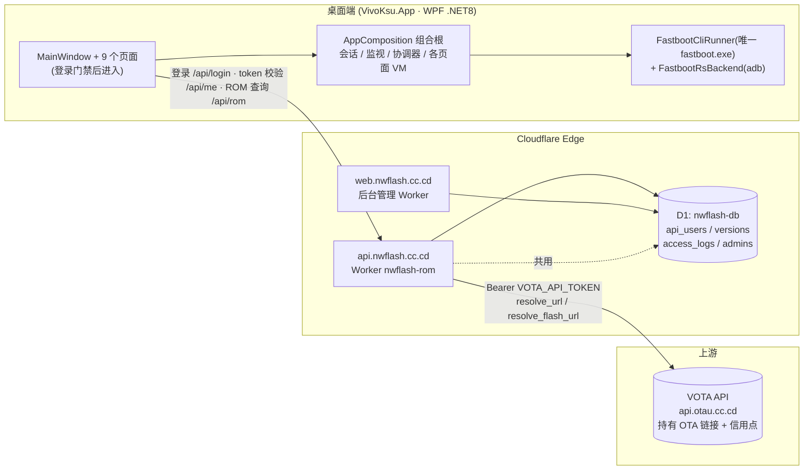

- **桌面端**持有账号密码或本地 token,通过 `api.nwflash.cc.cd` 登录、查询 ROM 链接,直接下载并刷写。
- **Worker** 唯一持有 VOTA API Token(secret),校验登录、做版本控制、转发到 VOTA 并记访问日志。
- **Web 后台**管理用户 / 版本 / 日志,与 API 共用同一个 D1 数据库。

### 关键原则

| 原则 | 落地 |
| --- | --- |
| **凭据隔离** | VOTA Token 只存 Worker secret;桌面端代码无 `api.otau.cc.cd` 与 token |
| **商业门禁** | 桌面端启动必须登录(`/api/login`);`/api/rom` 强制带 token,封禁用户 403 |
| **版本控制** | 只有后台「版本号控制」启用的 PD+版本才返回链接 |
| **按用户审计** | 每次 ROM 查询写 `access_logs`(用户 / PD / 版本 / URL / 状态) |
| **任务原子性** | 所有耗时操作经 `OperationCoordinator` 串行、可取消、失败即停、进度 100ms 节流 |
| **零自有服务器** | 全部后端跑在 Cloudflare Workers + D1;`src/VivoKsu.Server` 仅作本地开发回退,生产不用 |

---

## 2. 仓库结构

```
VivoKsu 工具/
├─ VivoKsu.slnx                     # 解决方案(src 2 项目 + tests 2 项目)
├─ src/
│  ├─ VivoKsu.App/                  # 桌面应用(net8.0-windows, WPF)
│  │  ├─ App.xaml(.cs)              # 启动门禁 / 崩溃日志 / 退出清理
│  │  ├─ MainWindow.xaml(.cs)       # 单窗口多页面导航 + 全部 XAML
│  │  ├─ LoginWindow.xaml(.cs)      # 登录窗口(taste 风格)
│  │  ├─ Models/                    # 领域模型(AppPage / 分区 / payload / 快照 / 日志…)
│  │  ├─ ViewModels/                # 各页面 MVVM 视图模型(15 个)
│  │  ├─ Services/                  # 业务服务与基础设施(40+ 个)
│  │  ├─ apk/                       # KernelSU 安装包(KSU.APK / KernelSU.apk)
│  │  ├─ payload-tools/             # payload_dumper.exe(payload-dumper-rust)
│  │  ├─ platform-tools/            # adb.exe + 唯一 fastboot.exe(带进度)
│  │  ├─ root-tools/                # magiskboot.so
│  │  └─ scrcpy/                    # scrcpy(发布脚本自动补齐)
│  └─ VivoKsu.Server/               # 旧 .NET 服务端(已被 Worker 取代,保留作本地回退)
├─ cloudflare/                      # Worker + 后台(见 §4 §5)
├─ tests/
│  ├─ VivoKsu.App.Tests/            # 桌面应用单元测试(约 50 个文件)
│  └─ VivoKsu.Server.Tests/         # 服务端测试
├─ scripts/
│  ├─ Publish-Release.ps1           # 一键发布 self-contained win-x64
│  ├─ Ensure-Scrcpy.ps1             # 发布前自动获取 scrcpy
│  └─ verify-*.ps1                  # UI 自动化验证脚本(UIA 导航 + 截图像素采样)
├─ docs/                            # architecture.md(本文) / safeflash-ota.md
└─ third_party/                     # fastboot-rs 源码参考(fastboot_flash 错误码来源)
```

---

## 3. 桌面端架构

### 3.1 启动流程与登录门禁

入口在 [App.xaml.cs](src/VivoKsu.App/App.xaml.cs):

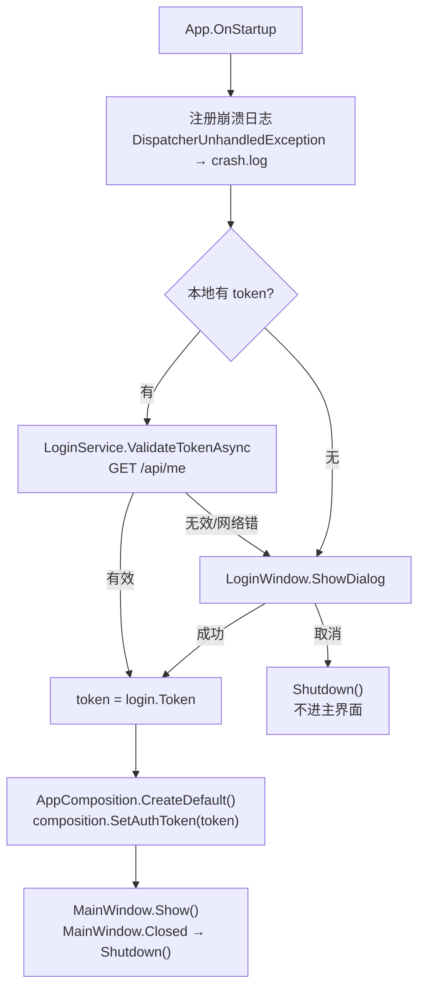

要点:

- **记住登录**:本地 token 有效(`/api/me` 返回 `loggedIn:true`)直接进主界面;失效则回登录窗。
- **`ConfigureAwait(false)` 防死锁**:启动门禁用 `GetAwaiter().GetResult()` 同步等待,若延续回到尚未跑消息泵的 Dispatcher 会死锁([LoginService.cs](src/VivoKsu.App/Services/LoginService.cs))。
- **退出清理**:`OnExit` 用 `DispatcherFrame` 泵消息最多 5s 等 `composition.StopAsync()` 完成 —— 清理下载的 Vivo 临时 gzip 与各盘 `VivoKsu\safe-flash` staging,并停监视/镜像进程。
- **崩溃日志**:未捕获异常写 `%LOCALAPPDATA%\VivoKsu\crash.log`(商业工具排查用)。
- **登录后程序消失修复**:`ShowDialog` 关闭触发 `OnLastWindowClose` 退出 —— 改为主窗口显式 `Closed += Shutdown()`。

### 3.2 组合根与依赖组装(无第三方 DI)

[AppComposition.cs](src/VivoKsu.App/Services/AppComposition.cs) 手写组合根,一次构建整个对象图:

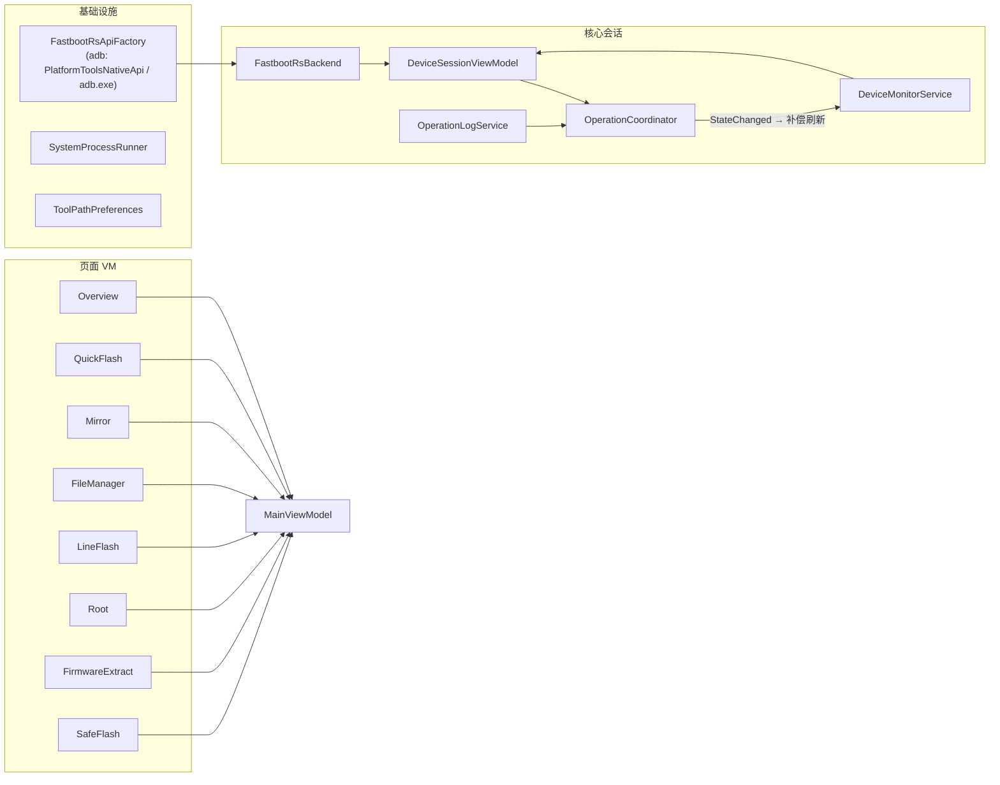

关键接线:

- `Monitor.DeviceRefreshed += MainViewModel.OnDeviceRefreshedAsync` —— 设备身份变化时触发(页面事件)。
- **跨页面联动**:固件提取 / Root 产物的「刷入此镜像」回调把镜像交 `QuickFlash.PreparePatchedImage` 并切到快速刷写页。
- `SetAuthToken(token)` 把登录 token 注入 `OtaApiClient`(后续 `/api/rom` 带 `Authorization: Bearer`)。

### 3.3 MVVM 与页面导航

单窗口 + 左侧导航,`MainWindow.xaml` 用一个 `Grid` 按 `SelectedPage` 做 `DataTrigger` 显隐切换页面。右侧固定 **DEVICE STATUS 卡片**(设备信息 + 双进度条)。

| AppPage 枚举 | 页面 | 核心 ViewModel |
| --- | --- | --- |
| `Overview` | 设备概览 | `OverviewViewModel` |
| `FastbootFlash` | 快速刷写 | `QuickFlashViewModel` |
| `AdbActions` | ADB 投屏 | `MirrorViewModel` |
| `RootTools` | Vivo ROOT | `RootViewModel` |
| `FileTransfer` | 文件管理 | `FileManagerViewModel` |
| `LineFlash` | 可视刷写 | `LineFlashViewModel` + `PartitionWorkspaceViewModel` |
| `FirmwareExtract` | 固件提取 | `FirmwareExtractViewModel` |
| `SafeFlash` | VIVO 线刷 | `SafeFlashViewModel` |
| `OperationLog` | 操作日志 | `OperationLogViewModel` |

技术底座:**CommunityToolkit.Mvvm 8.4**(`[ObservableProperty]` / `[RelayCommand]`)+ HandyControl 3.5.1 + teal 主题(参考 taste-skill 审美迭代)。

### 3.4 设备监视与会话(三通道 + 防抖)

[DeviceMonitorService.cs](src/VivoKsu.App/Services/DeviceMonitorService.cs) 用 `PeriodicTimer`(默认 3s)轮询,三种入口:

1. **心跳轮询** `RefreshHeartbeatAsync` —— 每 tick 刷新会话(电量/型号等),**仅在设备身份(连接状态/串号)变化时才触发下游 `DeviceRefreshed`**。
2. **手动刷新** `RefreshManualAsync` —— 用户点「刷新设备」,`forceFire:true` 必触发下游。
3. **补偿刷新** —— 监听 `coordinator.StateChanged`,操作结束(从 busy→idle)后自动补一次刷新。

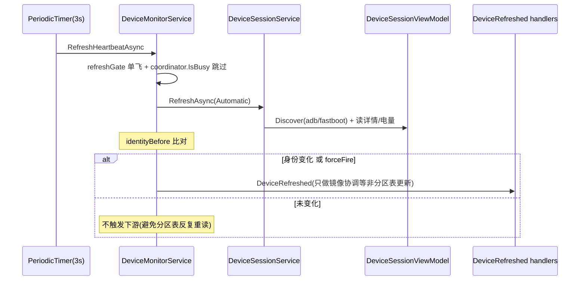

设计要点:

- **分区表只在用户点击「读取分区表」时读** —— 心跳 / 补偿刷新都不会重读,防止刷写中途被反复读取打断。
- **自动断开防抖**:连续 2 次心跳测到 disconnected 才真正断(瞬时抖动不误拉)。
- **连续失败降级**:自动刷新连续失败 3 次 → 记错误并标记未连接,避免「已连接」幻影设备让用户操作全静默失败。
- 刷新经 `SynchronizationContext` 回 UI 线程;`refreshGate` 保证不并发。

### 3.5 操作协调器与日志

[OperationCoordinator.cs](src/VivoKsu.App/Services/OperationCoordinator.cs) 是所有耗时操作的门:

- `RunAsync(kind, title, operation)` —— `SemaphoreSlim` 串行化;`CancellationTokenSource` 可取消;`StateChanged` 事件广播。
- 进度 `Report(stage, progress)` 分两种:**阶段变化**立即广播 + 写日志;**纯进度变化** 100ms 节流。
- 结束状态自动写日志(完成 ✅ / 取消 ⚠ / 失败 ❌)。
- `DeviceSessionViewModel` 的 `IsBusy` / `StatusText` / `ConnectionAccentBrush` 由协调器驱动,UI 据此禁用按钮。

[OperationLogService.cs](src/VivoKsu.App/Services/OperationLogService.cs) 按级别(Info/Success/Warning/Error)记录所有操作;操作日志页用 `[HH:mm:ss] 消息` 单行等宽显示并自动滚底。

### 3.6 后端抽象(adb + 唯一 fastboot.exe)

fastboot-rs 原生 DLL 已整体移除(错误码不可读、无刷写进度)。刷写后端统一为一个 **`FastbootCliRunner`**,指向唯一 `platform-tools/fastboot.exe`(35.0.2-eng,带进度),承担**全部** fastboot 操作并带**连续传输进度**:

```
FastbootCliRunner (唯一 fastboot.exe)
├── FlashAsync(serial, partition, image, progress)  连续进度:GetProcessIoCounters 采样 写字节/镜像大小
├── GetVarAsync / PartitionExistsAsync              剥离 (bootloader) 前缀;区分「无分区」vs「传输失败」
├── EraseAsync / RebootAsync / SetActiveAsync
└── 错误 = exit code + 输出文本(可读,不再有 C ABI 错误码)
```

- **`FastbootRsBackend`**(经 `IFastbootRsNativeApi` / `PlatformToolsNativeApi`)仅保留 **ADB 能力**:设备发现 / shell / 文件传输 / 安装 / adb reboot。
- **进度**:flash 用「无进展超时」+ 每 250ms 采样 `GetProcessIoCounters`,`进度 = 进程写字节 / 镜像大小`(慢速 USB 刷 4-6GB 大分区不被强杀,且有真实百分比)。
- **超时策略**:flash 无进展超时 600s;getvar 探测 20s 墙钟(非零退出区分「无分区」vs「传输失败」);erase/reboot/set_active 60s 墙钟。

> 为什么统一 CLI?fastboot DLL 的 `fastboot_flash` C ABI 只回粗错误码(多数失败归 `-8`),getvar/reboot 把所有失败压成 `-4`,拿不到原因;CLI 打印可读错误(无设备 + 检查清单 / 镜像未找到:<路径> / 设备 FAIL 消息),且能采样出真实进度。

### 3.7 分区传输抽象

`IPartitionTransport` 封装两种通道,可视刷写按连接状态自动选择:

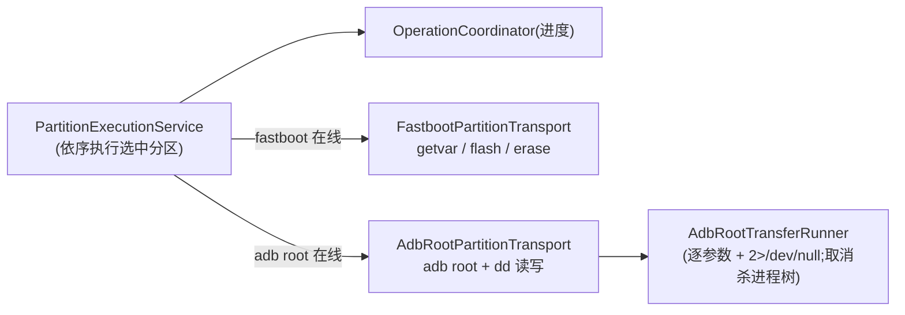

要点:

- **`AdbRootPartitionTransport`** 用 `dd` 走 adb root 通道读/写分区;`EnsurePartitionUnchangedAsync` 按 `ResolveByNameTemplate` 重解析 by-name 多布局设备。
- **`PartitionExecutionService`** 依序执行,进度经 `OperationCoordinator` 100ms 节流上报;首个失败分区即停。
- 备份有**完整性校验**:`task.SizeBytes` 必须等于备份文件长度,否则抛错(防备份不完整误判成功)。

### 3.8 固件提取流水线

[FirmwarePartitionExtractor.cs](src/VivoKsu.App/Services/FirmwarePartitionExtractor.cs) 按 zip 内是否含 `payload.bin` 分流;`FirmwareFormatDetector` 按魔数(由提取器内联判断)分流:

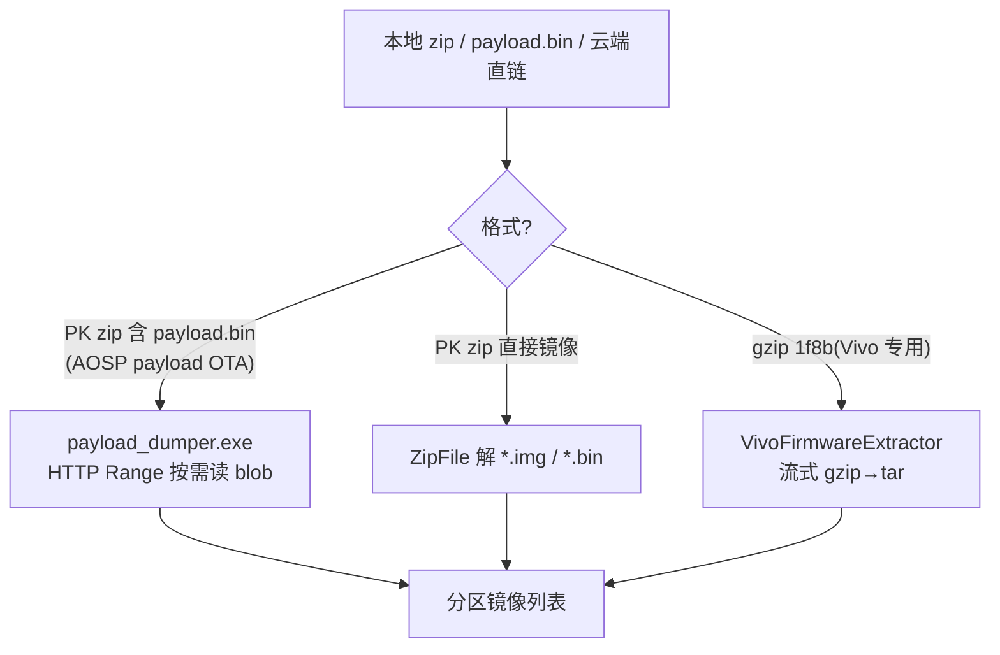

**实时进度(重点)**:payload_dumper 不输出流式进度,且其网络读取(Rust reqwest 走 IOCP/AFD)不计入进程 `ReadTransferCount`。可靠信号是**进程写入字节数 `WriteTransferCount`** —— 后台每 200ms 采样 `GetProcessIoCounters`,按分区 `size_in_bytes` 作分母,得到真实连续进度条与速度。Vivo gzip 路径以已解压字节 / gzip 总量直接报进度。

- **块式内容检测**:`HasBlockBasedContent` 识别 `.new.dat` / `.patch.dat` / `.transfer.list`(块式分区暂不支持刷),确认弹窗给警告。
- **`PayloadDumperRunner`**:同样是「无进展超时」(监控进程 I/O),不再 120s 硬超时杀解包。

### 3.9 安全刷写(VIVO 线刷)全链路

[SafeFlashViewModel.cs](src/VivoKsu.App/ViewModels/SafeFlashViewModel.cs) 的核心流程(详见 [safeflash-ota.md](safeflash-ota.md)):

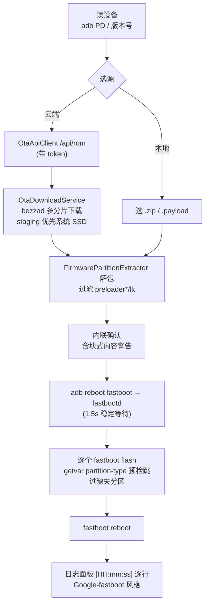

要点:

- **三种 Vivo OTA 结构**:payload OTA(PD2417)/ 直接镜像 zip(PD2057)/ firmware-update 镜像(PD2196),块式 OS 分区只警告不刷。
- **`WaitForFastbootAsync` 直接轮询 `backend.DiscoverAsync`**(不依赖冻结的会话快照),避免 ADB→fastbootd 过渡时检测不到设备。
- **分区存在性预检**:每个分区 flash 前 `getvar partition-type:<name>`,设备没有的分区跳过 + 日志,避免未知分区中止半刷。
- **staging 清理**:取消 / 失败 / 退出都清理 staging;盘选择优先系统 SSD(≥15GB),bezzad 多分片随机写 HDD 会停滞。
- **进度分段**:解包 0–0.5、刷写 0.5–1,不重叠;右侧栏当前分区行显示 `百分比 · 速度 MB/s`。

### 3.10 其它关键服务

| 服务 | 职责 |
| --- | --- |
| `VivoRootResourceService` | Root 管理器 APK 校验(**SHA-256 白名单** + AndroidManifest.zip 检查,防被替换) |
| `VivoVendorBootProcessor` | vendor_boot 补丁处理(官方 / GKI 内核),GKI 缺失跳过;输出已存在先删再重试 |
| `VivoKsuDevicePatchService` | 设备 patch 应用(经 adb root) |
| `QuickFlashService` | 快速刷写:`is-userspace` getvar 失败降级不抛;`expectedSerial` 防串号错刷 |
| `MirrorService` + `ScrcpyProvisioningService` | scrcpy 投屏;自动投屏开关关闭时取消在途协调;`.staging` 目录清理 |
| `AdbFileService` | ADB root 通道文件浏览 / 上传 / 下载 / 删除 |
| `DeviceInfoService` | 读设备详情(版本 / 电量 / 型号) |
| `ToolPathPreferences` | 本地设置(settings.json),含登录 token 持久化 |

---

## 4. API 服务(Cloudflare Worker)

`api.nwflash.cc.cd` = Worker `nwflash-rom`(`cloudflare/src/index.ts`)。完整接口契约见 [cloudflare/API.md](../cloudflare/API.md)。

### 4.1 端点

| 端点 | 方法 | 说明 |
| --- | --- | --- |
| `/health` | GET | 健康检查 |
| `/api/login` | POST | 账号密码 → API token(桌面端登录) |
| `/api/me` | GET | 校验本地 token(记住登录) |
| `/api/rom?pd=&version=` | GET | 解析 OTA 直链(强制登录 + 版本控制 + 记日志) |

### 4.2 认证与授权模型

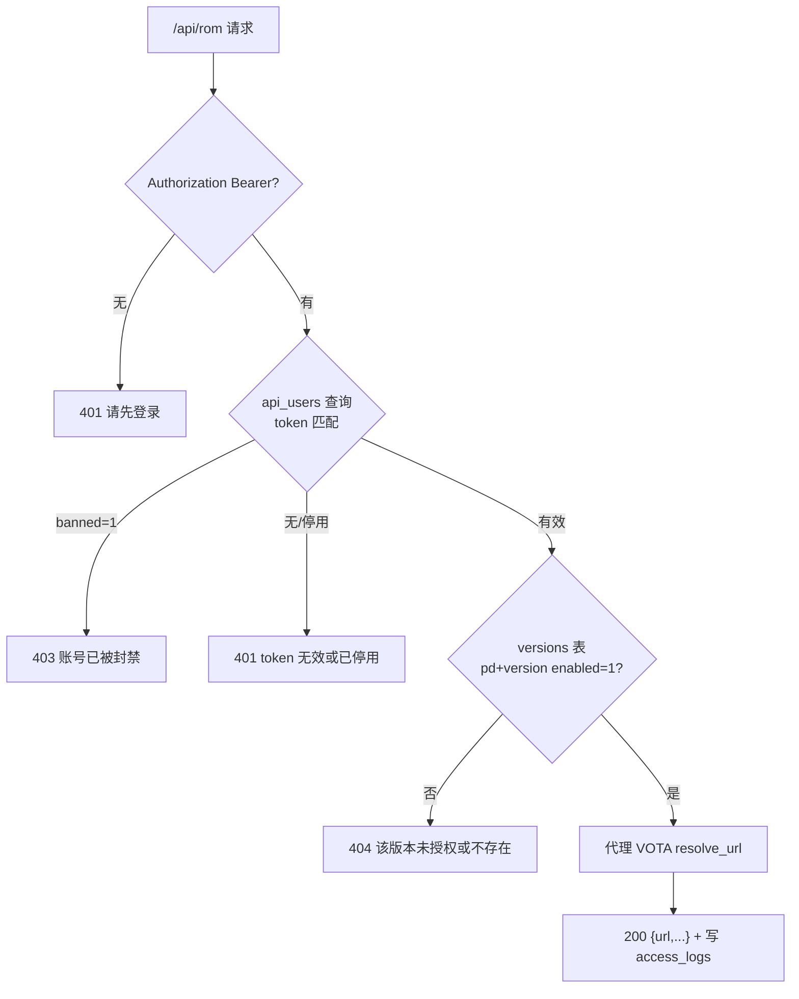

- **桌面端登录**(`/api/login`):`api_users.username` + PBKDF2-SHA256(100k 迭代)校验密码,成功返回该用户 token;封禁 / 停用 / 未设密码分别报错。
- **`/api/me`**:token → `{loggedIn, name}`(记住登录校验)。
- **`/api/rom`**:强制 token;**封禁用户 403**,版本未启用 404,成功 200 并记日志。

### 4.3 D1 数据模型(`nwflash-db`)

| 表 | 用途 | 关键列 |
| --- | --- | --- |
| `admins` | 后台管理员 | username / salt / password_hash |
| `admin_sessions` | 后台会话(7 天 cookie) | admin_id / token / expires_at |
| `api_users` | 客户端账号 = 桌面登录账号 | username(唯一) / name / token / password / salt / enabled / **banned** |
| `versions` | 版本号控制 | pd / version / enabled,`UNIQUE(pd,version)` |
| `access_logs` | 每次 ROM 查询审计 | api_user_id / api_user_name / pd / version / url / status |

### 4.4 错误映射(与 .NET 版一致)

| 上游 `code` | HTTP | 语义 |
| --- | --- | --- |
| `NOT_FOUND` / `not found` 文本 | 404 | 平台无此版本记录 |
| `AUTH_FAIL` | 401 | VOTA 认证失败 |
| `INSUFFICIENT_CREDITS` | 402 | 信用点不足 |
| `FORBIDDEN` | 403 | VOTA 拒绝(VER 白名单等) |
| `RATE_LIMITED` | 429 | 请求过频 |
| 其它 / 连不上上游 | 502 | 上游异常 |

### 4.5 上游计费 / 信用点(运营方成本)

每次成功 `resolve_url` 扣 **1 信用点**;`resolve_flash_url`(线刷)扣 **3 信用点**。信用点归属 **Worker 所持 VOTA token 的账户(运营方)**。这是 VivoKsu 运营方在上游 VOTA 的成本,**不对 VivoKsu 用户做任何扣点 / 按次计费** —— 用户只要登录即可查询;`record not found` / 参数错误不扣点。

### 4.6 商业运营闭环

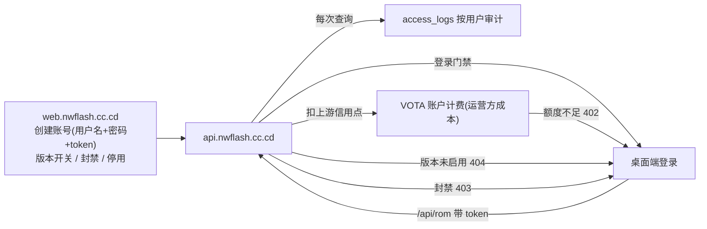

- **授权载体**:`api_users` 账号 = 登录凭证 + API token + `enabled`/`banned`。桌面端登录拿 token,ROM 查询凭 token。
- **版本授权**:只有 `versions` 表启用(pd+version)才放行,后台可随时开关。
- **审计闭环**:每次查询写 `access_logs`,后台可查谁在何时查了哪个版本、成功与否。
- **用户不按次计费**:VivoKsu 用户登录即可查询、不限次数;上游扣的是运营方账户的信用点(§4.5),`402` = 运营方上游余额不足,客户端提示「服务端信用点不足」。
- **处罚通道**:后台封禁 / 停用 → 登录 `401`、查询 `403`,**即时生效**——token 无本地缓存,天然可吊销。

---

## 5. Web 后台

`web.nwflash.cc.cd`(`cloudflare/web/src/index.ts`,详见 [cloudflare/web/README.md](../cloudflare/web/README.md)):

- **功能**:管理员登录、版本号控制、API 用户管理(建号 / token 生成轮换 / 停用 / 封禁)、访问日志。
- **安全**:强制 HTTPS + HSTS + CSP + HttpOnly/Secure 会话 Cookie + PBKDF2-SHA256 密码哈希 + 随机 session token;首启用 `ADMIN_SEED_PASSWORD` 播种初始管理员。
- 与 `api.nwflash.cc.cd` **共用同一 D1 `nwflash-db`** —— API 侧执行版本校验 / 认证 / 记日志,后台负责管理。

---

## 6. 数据流与关键时序

### 6.1 登录 → 查询 ROM → 下载 → 刷写

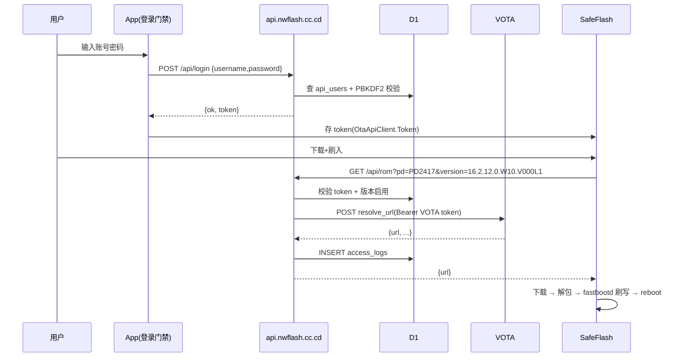

### 6.2 设备心跳与操作互斥

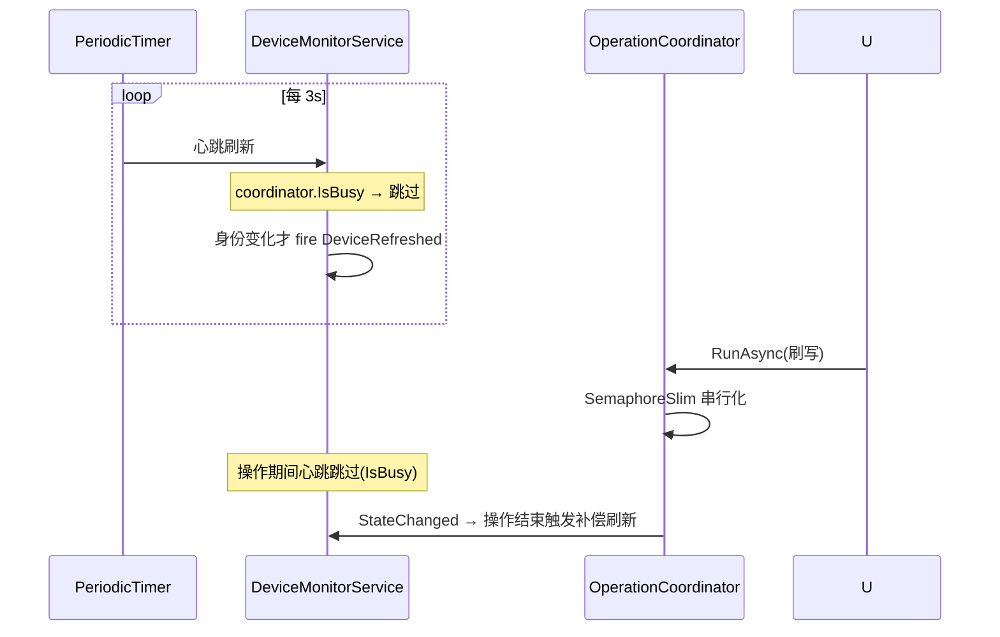

---

## 7. 关键设计决策与踩坑

| 决策 / 坑 | 解决 |
| --- | --- |
| fastboot DLL 错误码不可读(-4/-8),无刷写进度 | 整体移除 DLL,统一 `platform-tools/fastboot.exe`(35.0.2-eng)CLI:可读错误 + GetProcessIoCounters 连续进度 |
| 大分区刷写被固定超时强杀 | flash 用**无进展超时**(`GetProcessIoCounters` 读写仍在就重置);payload_dumper 同理 |
| bezzad/Downloader RangeHigh 只下 1 字节 | 先探测大小设 `RangeHigh = 大小-1`;失败不再假成功(检查 `DownloadFileCompleted` 异常) |
| 下载失败继续跑 PrepareFlash 空路径报错 | `sourcePath` 非空才 `PrepareFlashAsync` |
| staging / 临时 gzip 泄漏数 GB | 失败/取消/退出全链路清理;AppComposition.StopAsync 兜底扫盘 |
| 心跳导致分区表反复重读打断操作 | `DeviceRefreshed` 只在身份变化 / 手动 / 补偿时触发;分区表仅点按读取 |
| 自动刷新静默吞异常留幻影设备 | 连续 3 次失败降级未连接 + 记错误 |
| 备份无完整性校验 | 备份文件长度必须等于 `SizeBytes` |
| Root/快速刷写无串号绑定 | `expectedSerial` 与当前设备比对,防错刷 |
| KernelSU.apk 无校验 | SHA-256 白名单 + AndroidManifest 检查 |
| 取消不杀子进程 | adb / fastboot / scrcpy 全部杀进程树 |
| adb server 版本不一致检测不到设备 | 应用统一用内置 `platform-tools/adb.exe` 起 server |
| 自动投屏开关关闭不取消 | 关闭即取消在途协调 + 停止镜像 |
| 修补输出已存在阻塞重试 | `File.Exists` → 先删再解 |
| tar base-256 长度解析 | `ParseOctal` 支持 base-256 |
| 登录后程序消失 | `ShowDialog` 关闭触发 `OnLastWindowClose` → 改显式主窗 `Closed += Shutdown()` |

---

## 8. 测试

- **VivoKsu.App.Tests**:约 50 个测试文件、**253 个用例**全绿 —— 覆盖各服务与 VM 的分支、取消、进度、错误路径。
- **VivoKsu.Server.Tests**:8 个用例全绿(含 VOTA 非 2xx 状态码处理)。
- 关键测试:SafeFlash ADB→fastboot 过渡、本地 gzip 不被误删、截断备份被拒、多布局重解析、单预设只刷单个分区、篡改 APK 被拒、RecordRunner 3 参签名适配等。
- 运行:`dotnet test tests/VivoKsu.App.Tests/VivoKsu.App.Tests.csproj -c Debug`

---

## 9. 发布与内置组件

```powershell
./scripts/Publish-Release.ps1
```

产出 **self-contained win-x64**:`artifacts/release/VivoKsu-win-x64/` + `.zip` + `.sha256` + `SHA256SUMS.txt`(目录内逐文件清单)。发布前 `Ensure-Scrcpy.ps1` 自动补齐 scrcpy 并清理废弃资源(Sukisu.APK、ksud)。

| 内置组件 | 来源 | 用途 |
| --- | --- | --- |
| `payload-tools/payload_dumper.exe` | payload-dumper-rust | OTA payload 解包、云提取 |
| `platform-tools/adb.exe · fastboot.exe` | Android SDK Platform Tools | 设备通信(回退路径) |
| `platform-tools/fastboot.exe` | fastboot 35.0.2-eng(带进度,用户提供) | 全部 fastboot 刷写 / 读变量 / 擦除 / 重启 / 槽位 |
| `scrcpy/` | scrcpy | 屏幕镜像(发布时自动获取) |
| `root-tools/magiskboot.so` | Magisk | vendor_boot 补丁处理 |
| `apk/KSU.APK · KernelSU.apk` | KernelSU | Root 管理器安装包(带 SHA-256 校验) |

---

## 10. 已知限制

- **payload 分区内部百分比无法测量**:payload_dumper 预分配输出文件且不流式输出进度,分区内进度按进程写入字节驱动(真实但以分区为单位)。
- **分区操作有真实设备风险**:写入 / 擦除修改设备分区,执行前有确认弹窗,任务在首个失败分区停止。
- **`.ps1` 脚本必须纯 ASCII**:本机无 BOM 的 UTF-8 被按 GBK 读取会乱码(中文注释请用英文)。
- **唯一 fastboot.exe 待真机验证**:fastboot 35.0.2-eng 在 vivo fastbootd 逐个刷分区是唯一未真机实测环节。
- **下载盘需 ~25GB 空闲且最好是 SSD**:bezzad 多分片随机写 HDD 会停滞(staging 自动优先系统盘)。
- **VOTA 链接有时效**:`url` 带 `sign`/`t`,拿到后尽快下载。
- **版本需后台启用**:查询的 PD+版本必须在 `web.nwflash.cc.cd`「版本号控制」启用,否则 404。

---

## 相关文档

- [safeflash-ota.md](safeflash-ota.md) —— 安全刷写流程、OTA 格式、下载/刷写内部细节与踩坑。
- [cloudflare/API.md](../cloudflare/API.md) —— **api.nwflash.cc.cd 接口契约**(端点 / 参数 / 错误码 / 计费 / 功能记录)。
- [cloudflare/README.md](../cloudflare/README.md) —— Cloudflare Worker 部署说明。
- [cloudflare/web/README.md](../cloudflare/web/README.md) —— **web.nwflash.cc.cd 后台管理**。
- [README.md](../README.md) —— 项目总览与快速上手。
