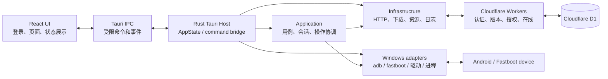
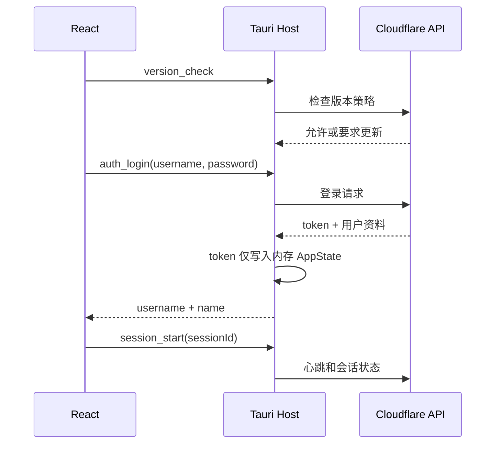

# 奶蛙Flash当前项目架构

> 本文描述当前交付主线：`src/Nwflash.Desktop/` 的 React + Tauri + Rust 客户端，以及其与 Cloudflare 服务的边界。`src/VivoKsu.App/` 的 WPF 实现保留为迁移历史和视觉基线，不是当前桌面端的实现依据。

## 1. 系统总览

奶蛙Flash是面向 Vivo 设备的 Windows 刷机与 Root 工具。桌面端负责登录后的设备发现、受控刷写、文件管理、ROOT 和资源安装；Cloudflare Worker 负责认证、版本门禁、会话、操作授权和在线服务。上游 ROM/OTA 凭据仅保留在服务端。



## 2. 仓库结构

```text
VivoKsu 工具/
├─ src/Nwflash.Desktop/                 # 当前 Windows 客户端
│  ├─ src/                              # React 页面、组件、应用状态和 IPC DTO
│  ├─ src-tauri/                        # Tauri 宿主和 Cargo workspace
│  │  └─ crates/
│  │     ├─ nwflash-domain              # 纯领域模型、错误、封闭枚举
│  │     ├─ nwflash-windows             # Windows 设备、进程与驱动适配器
│  │     ├─ nwflash-infrastructure      # HTTP、下载、资源、持久化适配器
│  │     ├─ nwflash-application         # 用例编排、会话与操作协调器
│  │     └─ nwflash-tauri               # AppState、command 和 event 边界
│  └─ e2e-tests/                        # WebDriverIO 原生交互和视觉测试
├─ cloudflare/                           # API、管理后台、用户门户与 D1 定义
├─ docs/                                 # 架构、迁移、发布与验收文档
├─ scripts/                              # 构建、发布、签名和验证脚本
└─ src/VivoKsu.App/                      # WPF 历史实现与视觉基线
```

## 3. 客户端分层

Cargo 依赖方向固定为：

```text
domain <- windows
domain <- infrastructure
domain + windows + infrastructure <- application
domain + windows + infrastructure + application <- tauri
```

| 层 | 责任 | 不应承担的责任 |
| --- | --- | --- |
| `nwflash-domain` | 设备、操作、分区、固件和错误模型 | Tauri、HTTP、文件系统、进程调用 |
| `nwflash-windows` | 固定的 adb/fastboot 命令、进程树取消、驱动检测与安装 | 业务授权、前端状态 |
| `nwflash-infrastructure` | Cloudflare 客户端、OTA 下载、资源校验、操作日志、缓存路径 | UI、任意设备命令 |
| `nwflash-application` | 操作互斥、取消、进度、设备会话、刷写和提取用例 | Tauri 类型、React DTO |
| `nwflash-tauri` | `AppState`、公开 command、事件投射和生命周期 | 把原始敏感状态交给 WebView |

`src-tauri/src/main.rs` 仅安装崩溃日志并调用 `nwflash_tauri::run_app`。Tauri 宿主在启动时创建 `AppState`，绑定设备监视、会话、操作和固件进度事件，再集中注册公开 command。

## 4. 前端与窗口

React `App.tsx` 是应用状态入口：

1. 执行版本检查。
2. 恢复并验证本地会话；无有效会话时只显示登录页。
3. 登录成功后启动 session、检查资源与驱动就绪状态，并渲染三栏主界面。
4. 订阅 `operation:snapshot`、`device:snapshot`、`session:force-exit` 和 `session:update-required`。
5. 根据登录态同步原生窗口：登录页客户区为 `400x564`，主界面客户区为 `1240x700`。

页面按设备、刷机和状态分组。React 只维护显示状态、用户意图和安全 DTO；设备 serial、token、原始进程命令、资源绝对路径和刷写计划不进入页面状态。

## 5. IPC 与安全边界

Tauri command 是浏览器与 Rust 的唯一业务边界。前端可以提交封闭枚举、用户确认、由原生文件对话框选择的路径或 Rust 生成的不透明 ID；Rust 在执行前重新校验所有输入。

以下能力只保留在 Rust 内部：

- bearer token：仅存于 `AppState.session_token`；登录响应只投射用户名和显示名。
- 当前设备 serial：由 `DeviceRuntime` 从最新有效快照派生，前端不能指定。
- 外部程序、命令数组、shell 文本和环境变量：由 Windows 适配器固定构造。
- ROM URL、staging 目录、固件工件路径和刷写计划：由用例运行时保存，前端仅拿到安全摘要或 capability ID。
- 快速刷写、分区、ROOT 和 Safe Flash 的准备产物：只可由相同 Rust runtime 在确认执行时消费，不能由浏览器伪造或复用过期计划。

窗口 API 也受 Tauri capability 控制。`capabilities/default.json` 显式授予主窗口关闭、最小化、最大化、尺寸和可调整性权限；前端顺序等待窗口状态同步，避免登录后把主界面挤在登录窗口尺寸内。

## 6. 运行时数据流

### 认证与会话



版本要求、服务端强制下线或会话失效时，宿主会先取消正在运行的受控操作并等待短暂收尾，再向 React 发出 session 事件。

### 设备与操作

设备监视每三秒使用固定 ADB/Fastboot 探测命令刷新快照。应用层对自动断开和连续错误做防抖，并在操作结束后补一次设备刷新。设备变化通过 `device:snapshot` 事件推送给界面。

耗时操作统一进入 `OperationCoordinator`：

```text
用户意图 -> command -> 服务端操作授权 -> OperationCoordinator
          -> 单操作互斥 -> 进度/日志事件 -> 取消或完成收尾
          -> Windows adapter 执行固定参数数组 -> 设备
```

协调器负责互斥、授权、取消、进度和日志。首个错误或取消会停止后续设备命令；前端只消费路径安全的 `operation:snapshot`。

### 固件、ROOT 与资源

- 固件提取在 Rust 中检查本地来源，按 ZIP、payload 或 Vivo 压缩格式分流，并将工件保存为不透明 runtime ID。
- Quick Flash、可视刷写、ROOT 和 Safe Flash 都从当前设备快照和已验证工件构造受控计划；确认执行时再次解析 capability。
- ROOT 的服务器 OTA 来源由 `root_ota_check` 在 Rust 内使用当前 ADB 设备的 PD/版本和内存 token 解析；URL、serial、PD、版本和 staging 不进入 React。`root_ota_extract_images` 使用 HTTP Range 处理 payload OTA 或直接镜像 ZIP，仅取得 `init_boot`（或 `boot` 回退）和 `vendor_boot`，再注册为不透明 ROOT 镜像 capability。实际 boot 分区名贯穿 Vivo KSU 修补和刷写，避免把无 `init_boot` 的设备误刷到错误分区。
- platform-tools、驱动和 root-tools 作为 release resources 随包；scrcpy、ROOT 管理器 APK 和 payload_dumper 按需下载。下载使用 staging、长度和 SHA-256 校验，页面不接触下载路径。

## 7. 服务端边界

`cloudflare/` 是独立的 TypeScript Worker 系统：

| 服务 | 职责 |
| --- | --- |
| `api.nwflash.cc.cd` | 登录、版本检查、心跳、在线状态、操作授权、ROM 服务 |
| `web.nwflash.cc.cd` | 管理后台、用户和版本管理、审计查看 |
| `user.nwflash.cc.cd` | 用户门户、会话和密码管理 |
| `nwflash.cc.cd` | 产品网站 |

Workers 共享 D1 数据库，持有服务端机密和上游凭据。桌面端只连接公开的 NWflash API；上游 OTA 凭据不会写入前端、release 资源或本地配置。

## 8. 测试与发布

```powershell
# React 单元/组件测试
npm --prefix src/Nwflash.Desktop run test

# Rust workspace 测试
cargo test --manifest-path src/Nwflash.Desktop/src-tauri/Cargo.toml --workspace

# 生产前端和 Tauri 二进制
npm --prefix src/Nwflash.Desktop run build
npm --prefix src/Nwflash.Desktop run tauri -- build --no-bundle

# 发布物验证
./scripts/Publish-TauriRelease.ps1
./scripts/Verify-TauriRelease.ps1 -ReleaseRoot artifacts/tauri-release
./scripts/Test-TauriRelease.ps1
```

正式 Windows 发布物使用每用户 NSIS 安装器和嵌入式 WebView2 bootstrapper。发布 staging 目录由脚本标记和校验；构建缓存 `node_modules/`、`dist/`、`src-tauri/target/` 和临时测试输出不属于源码归档。

## 9. 临时文件与生命周期

项目文件、构建缓存和运行时 staging 必须分开管理：

| 类别 | 位置/示例 | 生命周期与处理方式 |
| --- | --- | --- |
| 固定发布资源 | `src/Nwflash.Desktop/src-tauri/resources/`、`src/VivoKsu.App/` | 属于源码或发布输入，不得作为临时文件删除 |
| Rust 运行时 staging | `%TEMP%\\nwflash-root-ota`、`%TEMP%\\nwflash-payload-extract-*`、Safe Flash 私有目录 | 由 Rust 创建并校验所有权；成功后交给对应 runtime，失败、取消、替换或会话结束时清理；不删除用户原始镜像 |
| 前端/Rust 构建缓存 | `src/Nwflash.Desktop/node_modules/`、`dist/`、`src-tauri/target/`、`src-tauri/gen/` | 可由 `npm install`、Vite、Cargo 或 Tauri 重新生成，不进入源码归档；发布前可安全清理 |
| 发布和本地工具暂存 | `artifacts/`、`output/`、`.superpowers/` | 仅用于本地发布、测试或 Codex 工作状态，已加入忽略规则；不作为交付输入 |

清理构建/本地状态时只针对上述明确目录执行，不能对仓库根目录、用户目录或 `%TEMP%` 做通配递归删除。清理后可用以下命令恢复开发依赖和构建产物：

```powershell
npm install --prefix src/Nwflash.Desktop
npm run build --prefix src/Nwflash.Desktop
cargo test --manifest-path src/Nwflash.Desktop/src-tauri/Cargo.toml --workspace
```

## 10. 现有限制与验收要求

- 只支持当前发现的一台设备；发现多台设备时拒绝继续操作。
- 真机刷写、驱动安装和 ROOT 必须在已备份、可恢复的专用设备或虚拟环境中验收；mock 测试不替代设备验收。
- 进程 stdout/stderr 的并发排空，以及 ROOT 已选镜像的内容指纹绑定，仍是后续整改项；不能把它们当作已完成安全能力。
- WPF 文档和截图可用于历史行为对照，当前命令、资源和 IPC 边界以本文件及 `src/Nwflash.Desktop/` 源码为准。
