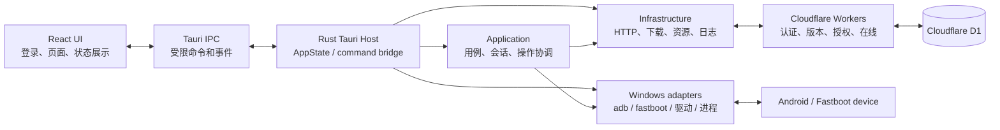
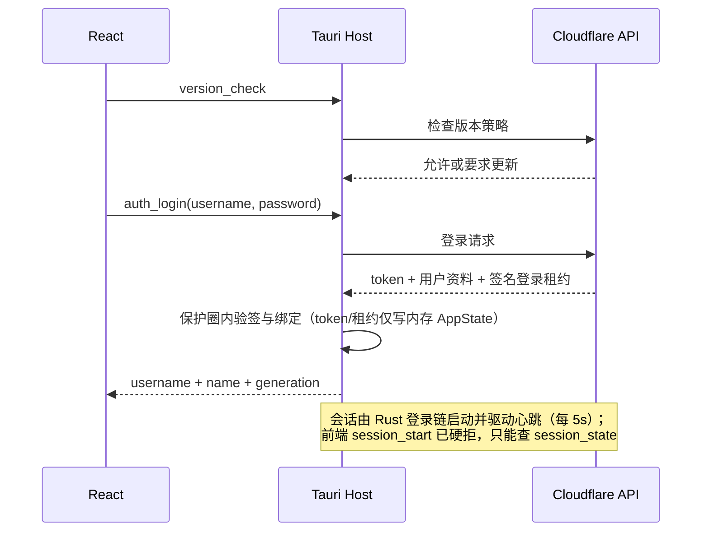

# 奶蛙Flash当前项目架构

> 本文是当前项目唯一的项目级架构规范，描述当前交付主线：`src/Nwflash.Desktop/` 的 React + Tauri + Rust 客户端，以及其与 Cloudflare 服务的边界。C# / WPF 实现已封存于 `archive/csharp/`，不属于当前桌面端的实现、资源或发布输入。

> 文档状态：2026-09-10。发布、资源供应和临时文件边界以当前脚本与 Rust workspace 为准；保护与完整性层以第 6 章为准；心跳退出语义与使用日志步骤数据通道以第 7 章为准。

## 1. 系统总览

奶蛙Flash是面向 Vivo 设备的 Windows 刷机与 Root 工具。桌面端负责登录后的设备发现、受控刷写、文件管理、ROOT 和资源安装；Cloudflare Worker 负责认证、版本门禁、会话、操作授权和在线服务。上游 ROM/OTA 凭据仅保留在服务端。



## 2. 仓库结构

```text
VivoKsu 工具/
├─ src/Nwflash.Desktop/                 # 当前 Windows 客户端
│  ├─ src/                              # React 页面、组件、应用状态和 IPC DTO
│  ├─ src-tauri/                        # Tauri 宿主和 Cargo workspace
│  │  └─ crates/
│  │     ├─ nwflash-domain              # 纯领域模型、错误、封闭枚举
│  │     ├─ nwflash-protection          # 签名租约验证、准入判定与 VMP 叶子（无 Tauri/异步依赖）
│  │     ├─ nwflash-windows             # Windows 设备、进程与驱动适配器
│  │     ├─ nwflash-infrastructure      # HTTP、下载、资源、持久化适配器
│  │     ├─ nwflash-application         # 用例编排、会话与操作协调器
│  │     └─ nwflash-tauri               # AppState、command 和 event 边界
│  └─ e2e-tests/                        # WebDriverIO 原生交互和视觉测试
├─ cloudflare/                           # API、管理后台、用户门户与 D1 定义
├─ docs/                                 # 架构、迁移、发布与验收文档
├─ scripts/                              # 构建、发布、签名和验证脚本
│  └─ vmp/                               # VMProtect 交付链合同（SDK 校验、链接布局、八叶符号表）
├─ packaging/vmprotect/                  # 发布策略：八区 marker 与 Lite GUI 交接规则
└─ archive/csharp/                       # 已冻结的 WPF 历史实现与测试
```

## 3. 客户端分层

客户端调用与 crate 依赖关系固定为：

```text
React -> Tauri invoke/event -> nwflash-tauri -> nwflash-application
                                            |-> nwflash-infrastructure
                                            |-> nwflash-windows
                                            |-> nwflash-protection（租约/准入/完整性/退出叶子）

nwflash-domain 被 nwflash-windows / nwflash-infrastructure / nwflash-application / nwflash-tauri / nwflash-protection 共享
```

| 层 | 责任 | 不应承担的责任 |
| --- | --- | --- |
| `nwflash-domain` | 设备、操作、分区、固件和错误模型 | Tauri、HTTP、文件系统、进程调用 |
| `nwflash-protection` | 同步签名租约验证（Ed25519）、本地准入与分类判定、镜像完整性分发、进程终结器、trace 凭据哨兵；VMP marker 边界 | 异步/Tokio、HTTP、Tauri 类型、原始 trace 文本、密码或 token 值 |
| `nwflash-windows` | 固定的 adb/fastboot 命令、进程树取消、驱动检测与安装 | 业务授权、前端状态 |
| `nwflash-infrastructure` | Cloudflare 客户端（pinned TLS + 编译期验签密钥）、OTA 下载与远程固件完整性门、资源校验、操作日志、缓存路径 | UI、任意设备命令 |
| `nwflash-application` | 操作互斥、取消、进度、设备会话、刷写和提取用例 | Tauri 类型、React DTO |
| `nwflash-tauri` | `AppState`、公开 command、事件投射和生命周期、退出监督器 | 把原始敏感状态交给 WebView |

`src-tauri/src/main.rs` 仅安装崩溃日志并调用 `nwflash_tauri::run_app`。Tauri 宿主在启动时创建 `AppState`；它持有 session token、`OperationCoordinator`、`DeviceRuntime`，以及固件、payload、分区、投屏、ROOT 和 Safe Flash 的私有 runtime。宿主随后绑定设备监视、会话、操作和固件进度事件；`generate_handler!` 注册表是公开 command 白名单，未注册的 helper 不是浏览器能力。

## 4. 前端与窗口

React `App.tsx` 是应用状态入口：

1. 执行版本检查。
2. 恢复并验证本地会话；无有效会话时只显示登录页。
3. 登录成功后启动 session、检查资源与驱动就绪状态，并渲染三栏主界面。
4. 订阅 `operation:snapshot`、`device:snapshot`、`session:force-exit` 和 `session:update-required`。
5. 根据登录态同步原生窗口：登录页客户区为 `400x564`，主界面客户区为 `1240x700`。

页面按设备、刷机和状态分组。React 主要维护显示状态、用户意图和 DTO；`DeviceSnapshot` 和 TypeScript `DeviceSnapshotPayload` 包含 serial，并由概览页显示当前设备。通用预设 Quick Flash 是当前例外：页面会把原生对话框选出的 `imagePath` 与封闭分区请求保存在 `PendingFlashPlan`，确认后重新提交给执行 command；公开 prepare API 还可返回含 serial 和 `ProcessCommandDto` 的 `QuickFlashPlanDto` 预览，这是现有/遗留 API 暴露限制。浏览器仍不能把 serial、任意程序或 shell 文本作为执行输入；token 和服务端解析的 ROM/OTA URL 仍留在 Rust。

## 5. IPC 与安全边界

> 产品决策（2026-08-21）：当前业务流程已移除运行时镜像/工件/OTA 哈希门禁和跨步骤设备 serial 绑定。serial 只保留为当前命令目标和显示字段；发行物和受控资源的完整性校验保留。完整规则见 [product-decisions.md](product-decisions.md)。

Tauri command 是浏览器与 Rust 的唯一业务边界。前端可以提交封闭枚举、用户确认、路径或 Rust 生成的不透明 ID，Rust 按各 command 的契约校验相关输入。UI 通常用原生文件/目录对话框取得路径，但 IPC 的 `String` 类型本身不能证明对话框 provenance；不能把所有路径都概括为原生对话框来源，也不能笼统声称 Rust 已重新校验每一种输入。

以下能力只保留在 Rust 内部：

- bearer token：仅存于 `AppState.session_token`；登录响应只投射用户名和显示名。
- 当前设备 serial：快照 DTO 和现有 `QuickFlashPlanDto` 预览可以将 serial 投射给 React，但公开执行 command 不接受 browser serial。Rust 只从当前 `DeviceRuntime` 派生实际 ADB/Fastboot 命令目标。
- 单设备与 serial 规则：每次启动只处理当前唯一设备，多设备仍拒绝；没有浏览器设备选择器或跨启动 serial 身份。计划/预览可为兼容保留瞬态 serial，但不得作为工件/capability 身份或执行门禁；每个执行阶段从当前唯一传输重新取得命令目标。
- 外部程序、命令数组、shell 文本和环境变量：只由 Rust/Windows 适配器构造，浏览器不能提交或改写；现有 `QuickFlashPlanDto` 可把 Rust 生成的 `ProcessCommandDto` 作为预览投射出去，但这些字段不是执行输入。
- 服务端解析的 ROM/OTA URL、staging 目录，以及固件工件、prepared dual-slot、ROOT 和 Safe Flash 的受保护计划由 Rust runtime 保存，前端仅拿到安全摘要或 capability ID。
- 不透明确认边界适用于固件工件、prepared dual-slot、ROOT 和 Safe Flash；通用预设 Quick Flash 不消费 Rust-owned confirmation capability，而是在单次 execution invocation 内重新检查 browser-held 请求。

窗口 API 也受 Tauri capability 控制。`capabilities/default.json` 显式授予主窗口关闭、最小化、最大化、尺寸、可调整性和标题栏拖拽权限（`core:window:allow-start-dragging`，无边框窗口拖动依赖该权限且不在默认集内）；前端顺序等待窗口状态同步，避免登录后把主界面挤在登录窗口尺寸内。

## 6. 保护与完整性层（2026-09-08）

登录制工具的核心防绕过设计：所有敏感判定收在受保护（VMProtect）的同步叶子内，圈外代码只做调度与展示；服务端签名是信任锚，本地判定 fail-closed。

### 6.1 签名租约会话

登录与心跳响应携带服务器 Ed25519 签名的租约信封（payload + signature，均为 base64url）。验证密钥经 `option_env!("NWFLASH_SESSION_VERIFY_KEY_B64")` **编译期**嵌入（`pinned_tls.rs`），pinset 在线刷新不可替换它。租约 claims 绑定 username、token SHA-256、client_version、build_id、process_nonce、session_id、sequence 和时间窗；本地准入逐项复验。会话能力（`SessionCapabilityScope`）只能由验签通过的租约激活，前端无任何 IPC 可直接置位。

生产验证公钥（Ed25519，32 字节，标准 base64）：

```text
HSNEfWZrjbZRhspVBhjcVOPxWiJJmx7tHO7JVMMug8o=
```

与 Cloudflare Worker secret `SESSION_SIGNING_PRIVATE_KEY_PKCS8` 成对；轮换签名密钥时必须同步更新此值并重编客户端。**重编注意**：该密钥与 `NWFLASH_BUILD_ID` 同为编译期变量——不带它们构建时 `AppState::try_new` 必然失败，fat LTO 会把整个应用主体（命令注册表、登录/心跳链、七个保护叶子）当作死代码裁掉，产物只剩 `--nwflash-protected-release-probe` 探针路径（约 1.1 MB 的残废二进制，且过不了 8/8 契约门）。

### 6.2 双重操作准入门

所有危险命令经 `OperationCoordinator.run_async` 先过权限门再执行闭包：

1. **本地门（`LocalProtectionGate`）**：对高危操作类别（Flashing/Installing/Rebooting/Transferring/Mirroring）执行签名租约复检 + 镜像完整性探针。**分类表在保护圈叶子内**（`requires_protected_recheck`，Ultra 区）——圈外打补丁改分类无法把刷写类操作绕进免检通道；未知类别 fail-closed 归高危。域枚举与保护圈表为穷举映射，新增 `OperationKind` 不同步扩展即编译失败。
2. **远端门（`CloudflareOperationPermissionGate`）**：所有类别（含 Hashing/Discovering）先查 Rust 侧 token，未登录硬拒；服务器授权为 advisory——仅 401（封禁）/426（版本）/Integrity 硬拒，网络故障放行（不可达的服务器不得阻止刷手上的设备），封禁由心跳在秒级内强退兜底。

租约时间判定带**墙钟回退锚点**（`ClockRegressionAnchor`）：回退超过 NTP 校正量级（120 秒）按完整性失败立即退出，小幅回退沿用历史最大时间——断网拨系统时间无法无限延长 300 秒租约边界。

### 6.3 VMProtect 八叶子与退出牙齿

`nwflash-protection` crate 的八个同步 marker 区（`packaging/vmprotect/README.md` 为发布策略真源，`scripts/vmp/` 为交付合同）：

| 叶子符号 | marker 名 | 模式 | 保护对象 |
| --- | --- | --- | --- |
| `nwflash_protection_accept_login_lease` | LoginLeaseAcceptance | Ultra | 登录租约验签与绑定 |
| `nwflash_protection_classify_heartbeat_lease` | HeartbeatLeaseClassification | Virtualization | 心跳租约分类 |
| `nwflash_protection_admit_local_operation` | OperationAdmission | Ultra | 本地准入（到期/构建/nonce） |
| `nwflash_protection_requires_protected_recheck` | OperationAdmission | Ultra | 高危分类表（防圈外改表绕检） |
| `nwflash_protection_verify_image_integrity` | ImageIntegrityDispatch | Virtualization | 镜像保护/CRC 分发 |
| `nwflash_protection_build_identity_matches` | BuildIdentity | Mutation | 构建标识比较 |
| `nwflash_protection_trace_credential_sentinel` | TraceCredentialSentinel | Ultra | trace 上传回执（无回执不上线，类型级强制） |
| `nwflash_protection_terminate_process` | TerminalExit | Ultra | 进程终结器（退出监督器与事件循环返回后的最终牙齿） |

退出链：完整性失败 → 退出监督器（750ms 收尾：lifecycle/usage/完整性上报 → 撤销能力 → zeroize token）→ 生产终结器调保护圈内 `terminate_protected_process` → `exit(70)`。release 构建对未加 VMProtect 的裸 exe fail-closed（启动即锁 ExitPending 全功能瘫痪后自杀）；VMP 保护是发布硬性要求。已接受的退出请求无任何前端 IPC 可取消。

### 6.4 网络与固件完整性

- API 通道全程 HTTPS + SPKI pin 双重校验（Mozilla 根 + 两枚内置 pin），重定向拒绝、无代理、SNI 固定；token 只出现在 sensitive 的 Authorization 头（`Zeroizing` 包裹），操作日志/trace/崩溃上传三级脱敏。
- **远程固件完整性门（若式硬门）**：`root_ota_check` 存服务器透传的整包 sha256/sizeBytes；`root_ota_extract_images` 在提取前流式读全包验 SHA-256（常量时间比较）与大小。服务器给了承诺就是硬门、格式无效报错不降级；上游常为空则跳过（对齐 C# 可用性）。手动 URL 固件链无服务器承诺，不做哈希门。
- `withGlobalTauri: false`：WebView 不暴露 `window.__TAURI__`，npm bundle 经 `__TAURI_INTERNALS__` 注入层；`hasTauriRuntime` 只认 internals.invoke。

### 6.5 步骤数据通道与 trace 哨兵（发布计划缺口）

当前实际在传的步骤数据通道是 **V1 使用日志 details**：`OperationContext.report_stage` 的每条阶段消息、操作终态与失败详情写入协调器 `operation_details`（相邻去重、500 条环形上限），操作结束随 `POST /api/usage/logs` 的 `details` 数组批量上报（durable spool + 登录代际绑定 + event_key 幂等重试）；服务端截断归一后落 `usage_logs.details_json`（500 条、单条 16 KiB）。管理后台审计视图对 schema-1 记录按时间线展示该字段（2026-09-10 起）；`legacy_client_no_step_data` 占位仅保留给确实未上传 details 的历史客户端记录。失败详情经 `sanitize_operation_detail` 脱敏（token/密码类赋值隐藏、240 字符裁剪）后才进入日志区。

trace-v2 上传链（丢弃观察者替换、持久 spool 接 producer facade）尚未接生产线，是 Plan C 的显式前置条件，见 `scripts/vmp/README.md`；当前生产 trace 仅有崩溃补传（`/api/diagnostics/crash`，同一脱敏管线）。

## 7. 运行时数据流

### 认证与会话



版本要求、服务端强制下线或会话失效时，宿主会先取消正在运行的受控操作并等待短暂收尾，再向 React 发出 session 事件。心跳响应本身是签名心跳租约：通过则刷新本地会话能力，ForceExit/封禁/序列回卷按各自语义走 delayed 或 immediate（完整性类）退出。

**心跳退出语义（2026-09-10，提交 57b4cea）**：

| 状态 | 行为 |
| --- | --- |
| 操作执行中（busy） | 心跳失败**永不计数、永不退出**；失败计数清零 |
| 空闲（idle） | 连续 10 次心跳失败 → 写一行日志后静默退出（无弹窗、无 goodbye） |
| 任一次成功 / busy 转换 | 失败计数复位 |
| 服务端 `force_exit` | 无条件即时终止进程（无弹窗，绕过一切收尾） |

保留的终止路径：426 强制更新（弹更新窗，无跳过）；Rust Integrity（租约验签/绑定/时钟回退锚点）失败即完整性退出。租约过期由服务端 120s 在线窗口 Cron 清理兜底——心跳返回 410（行被清理但 token 有效）在空闲计数器中按普通失败累计，不再触发独立退出路径。

### 设备与操作

设备监视每三秒使用固定 ADB/Fastboot 探测命令刷新快照。应用层对自动断开和连续错误做防抖，并在操作结束后补一次设备刷新。设备变化通过 `device:snapshot` 事件推送给界面。

耗时操作统一进入 `OperationCoordinator`：

```text
用户意图 -> command -> 双重权限门（本地租约门 + 远端 token 门）
          -> 单操作互斥 -> 进度/日志事件 -> 取消或完成收尾
          -> Windows adapter 执行固定参数数组 -> 设备
```

协调器负责互斥、授权、取消、进度和日志。首个错误或取消会停止后续设备命令；前端只消费路径安全的 `operation:snapshot`。scrcpy 组件供给（failover 下载）发生在 Mirroring 准入门内，与其他资源安装语义一致。

### 固件、ROOT 与资源

- 固件提取在 Rust 中检查本地来源，按 ZIP、payload 或 Vivo 压缩格式分流，并将工件保存为不透明 runtime ID。
- 通用预设 Quick Flash 的确认模态只保存在浏览器：React 持有原生对话框选出的镜像路径/封闭分区请求，确认后调用 `quick_flash_execute_preset_images`。Rust 在同一次 execution invocation 中重新检查镜像；执行边界立即从当前 `DeviceRuntime` 解析唯一 transport serial，覆盖任何历史/预检 serial 后再构造 flash、切槽和重启命令。该路径不消费不透明 Rust confirmation capability。
- 固件工件、prepared dual-slot、ROOT 和 Safe Flash 使用 Rust-owned runtime/capability 保存准备产物，确认执行时按各自契约重新解析或一次性消费。
- 公开 `quick_flash_prepare_boot_image`/`quick_flash_prepare_preset_image` 仍返回 `QuickFlashPlanDto`，其中含 serial 和 Rust 生成的 `ProcessCommandDto` 程序/参数预览。这是当前/遗留 API 限制，不能据此声称原始命令或 flash plan 从不跨入浏览器；浏览器仍不能把任意程序、命令数组或 shell 文本提交为执行计划。
- ROOT 的服务器 OTA 来源由 `root_ota_check` 在 Rust 内使用当前 ADB 设备的 PD/版本和内存 token 解析；私有 `RootOtaRuntime` 保存来源元数据和 session epoch，不把手机 serial 作为绑定字段。`root_ota_extract_images` 不接收浏览器 serial，只在需要当前 ADB 命令时临时取得目标，不做提取前后 serial 等值比较；产物以 session epoch 和不透明 ID 约束。该流程使用 HTTP Range 处理 payload OTA 或直接镜像 ZIP，仅取得 `init_boot`（或 `boot` 回退）和 `vendor_boot`；实际 boot 分区名贯穿 Vivo KSU 修补和刷写。ROOT OTA 的 URL、PD、版本和 staging 不进入 React；独立 `DeviceSnapshot` 中的 serial 仍只用于界面显示。
- platform-tools、驱动、root-tools、完整 scrcpy、ROOT 管理器 APK 和 payload_dumper 都作为 release resources 随包，并由 `packaging/release/tauri-resources.json` 的精确白名单和 SHA-256 固定。固定工具资源只从 bundle 校验和使用；ROM/OTA 内容仍按请求读取，页面不接触资源路径。

### 近期实现约定

- **ADB Root 分区读取**：设备命令统一使用 `adb shell -T su -c '<完整命令>'`，Rust 先对整个 shell 命令和设备路径做引用，再传给 `su -c`。读取流程先校验 `id -u`、当前槽位和设备路径，任何一步失败都拒绝解析分区表，避免参数被设备 shell 拆开后产生语法错误。
- **分区备份**：用户通过原生目录对话框选择输出目录后立即执行 `partitions_execute_backup`，不再显示二次确认或把本地路径交给 React 状态。每个分区先重新解析设备路径，输出写入 `.partial` 文件，完成大小校验后原子替换为最终文件；取消或失败会删除 partial 文件。
- **操作日志**：日志只显示当前会话的实际设备操作，按时间戳从旧到新排列，最新记录固定在底部。常规的连接服务器、请求服务和检测服务器探测不写入面板；历史 OTA 文案在显示边界统一为服务器/固件，避免重复刷屏和暴露内部服务实现名。
- **用户可见文案零 OTA 字样（2026-09-10）**：页面、操作日志与上报步骤数据的源头文案已全部去除 OTA 字样与刷入方法描述（fastbootd 重启、逐分区刷写、`.new.dat` 块式内容等）；"请求 OTA 服务器"一类统一改为"请求线刷系统"措辞。显示层（前端操作日志组件与宿主 `normalize_operation_log_message`）只保留 `OTA→固件` 的防御性兜底替换，防新代码漏网。内部标识符（`OtaApiClient`、`root_ota.rs`、`runOtaCheck` 等类型/变量名）有意不改。
- **在线固件请求**：服务器固件检查和提取仍由 Rust 使用内存会话令牌完成，React 只接收可用状态、显示标签和安全结果，不接收上游 URL。界面文案使用“请求服务器”“在线固件”等通用名称，不把内部 OTA 服务名当作用户操作日志。
- **HTTP(S) 固件提取**：`FirmwareExtractPage` 支持本地来源和用户粘贴的 HTTP 或 HTTPS 地址。输出目录统一由 Rust command `firmware_select_output_directory` 调起原生目录对话框，并在进程内保存为 UUID v4 不透明 capability；选择 DTO 只有 ID，本地 VIVO/ZIP、payload 和远程提取 invoke 都只提交 `output_directory_id`。每次打开 picker 与 cleanup 都推进单调 epoch，只有当前 picker 的成功选择可以发布；重新选择会使旧 ID 失效，当前 picker 取消保留上一能力，乱序或跨 logout/session-stop 完成 fail closed。`session_stop`、`auth_logout` 和受保护退出清理都会撤销当前能力。各 firmware extract command 从 Rust runtime 解析真实 `PathBuf`，空、伪造、旧 ID 或原始路径字符串均拒绝；当前有效 ID 可用于向同一用户已选目录重复提取。Rust 同时校验 URL scheme/host、已检查来源等值、不透明分区 ID 和归档成员；远程 ZIP 只 Range 读取所需成员，先写 `.partial`、核对大小再原子重命名，payload 结果也经受控 partial/发布流程。
- **scrcpy 供应**：页面不提供 scrcpy 文件选择按钮。发布包内置 `resources/scrcpy` 及 `scrcpy-files.sha256`，Rust 在启动前校验完整文件清单；不回退到用户 `PATH`，资源缺失或校验失败时提示重新安装应用。

## 8. 服务端边界

`cloudflare/` 是独立的 TypeScript Worker 系统：

| 服务 | 职责 |
| --- | --- |
| `api.nwflash.cc.cd` | 登录、版本检查、心跳、在线状态、操作授权、ROM 服务 |
| `web.nwflash.cc.cd` | 管理后台、用户和版本管理、审计查看 |
| `user.nwflash.cc.cd` | 用户门户、会话和密码管理 |
| `nwflash.cc.cd` | 产品网站 |

Workers 共享 D1 数据库，持有服务端机密和上游凭据。桌面端只连接公开的 NWflash API；上游 OTA 凭据不会写入前端、release 资源或本地配置。

## 9. 测试与发布

```powershell
# React 单元/组件测试
npm --prefix src/Nwflash.Desktop run test

# Rust workspace 测试
cargo test --manifest-path src/Nwflash.Desktop/src-tauri/Cargo.toml --workspace

# 生产前端和 Tauri 二进制
npm --prefix src/Nwflash.Desktop run build
npm --prefix src/Nwflash.Desktop run tauri -- build --no-bundle

# 发布物验证
./scripts/Publish-TauriRelease.ps1
./scripts/Verify-TauriRelease.ps1 -ReleaseRoot artifacts/tauri-release
./scripts/Test-TauriRelease.ps1
```

正式 Windows 发布物使用每用户 NSIS 安装器和嵌入式 WebView2 bootstrapper。`Publish-TauriRelease.ps1` 默认执行 Rust/前端/原生 E2E 检查、受控 VMProtect、证书 thumbprint 校验、EXE 与安装器签名、安装验证和精确 SHA-256 清单；只有显式传入 `-DevelopmentUnsigned` 才允许生成未签名开发暂存，不能作为正式发布物。`Verify-TauriRelease.ps1` 只读取并核验既有清单，拒绝额外文件且要求所有内置工具资源存在并匹配清单。发布 staging 目录由脚本标记和校验；构建缓存 `node_modules/`、`dist/`、`src-tauri/target/` 和临时测试输出不属于源码归档。

## 10. 临时文件与生命周期

项目文件、构建缓存和运行时 staging 必须分开管理：

| 类别 | 位置/示例 | 生命周期与处理方式 |
| --- | --- | --- |
| 固定发布资源 | `src/Nwflash.Desktop/src-tauri/resources/` | Rust/Tauri 的唯一源码与发布输入，不得作为临时文件删除 |
| Rust 运行时 staging | `%TEMP%\\nwflash-root-ota`、`%TEMP%\\nwflash-payload-extract-*`、Safe Flash 私有目录 | 由 Rust 创建并校验所有权；成功后交给对应 runtime，失败、取消、替换或会话结束时清理；不删除用户原始镜像 |
| 前端/Rust 构建缓存 | `src/Nwflash.Desktop/node_modules/`、`dist/`、`src-tauri/target/debug`、`src-tauri/gen/` | `node_modules`、`dist`、`target/debug` 和 `gen` 属于可重新生成的本地构建状态；`target/release` 属于发布输出，不按普通构建缓存处理。具体默认清理授权见下方唯一规范 |
| 发布和本地工具暂存 | `artifacts/`、`output/`、`.superpowers/` | 仅用于本地发布、测试或 Codex 工作状态，已加入忽略规则；不作为交付输入 |

默认深度清理的唯一规范是：完成目标验证后，只删除 `src-tauri/target/debug` 和 `e2e-tests/logs/*.log`；`target/release-rebuild` 与 `src-tauri/target/release` 的全部内容（含 `bundle`、`nsis`、`resources` 和 EXE）均属于保留范围，其中已经生成并验证的安装包是发布物；`node_modules`、`dist`、`gen` 和 `.superpowers` 也不在默认清理范围。清理必须只命中这些明确目标，不能对仓库根目录、用户目录或 `%TEMP%` 做通配递归删除。

若后续按需重建开发依赖和构建产物，可运行：

```powershell
npm install --prefix src/Nwflash.Desktop
npm run build --prefix src/Nwflash.Desktop
cargo test --manifest-path src/Nwflash.Desktop/src-tauri/Cargo.toml --workspace
```

## 11. 现有限制与验收要求

- 只支持当前发现的一台设备；发现多台设备时拒绝继续操作。
- 真机刷写、驱动安装和 ROOT 必须在已备份、可恢复的专用设备或虚拟环境中验收；mock 测试不替代设备验收。
- 源码阅读、文档/静态检查和 mock 测试不构成原生 WDIO/显示传输、签名/VMProtect、安装器/release、真实网络或 Cloudflare 部署验收；这些项目仍须在对应外部环境按验收矩阵完成。
- 固件提取输出目录边界已统一改为 Rust 原生对话框签发、进程内保存的不透明 capability；浏览器不再能用任意 `output_directory: String` 指定本地或远程固件写入位置。无头测试验证 capability 的签发、并发 picker epoch、替换、取消、复用、会话撤销和 fail-closed 语义；真实原生目录对话框仍需桌面 E2E 验收。
- 进程 stdout/stderr 在子进程运行期间由独立 reader 并发排空；正常完成会在构造输出前回收 reader，取消或超时会在终止并回收子进程后回收 reader。大输出与 reader 失败回归测试覆盖该边界。ROOT 镜像/修补工件不再记录或复核运行时 SHA-256/fingerprint；路径、格式、大小、不透明 ID、session epoch 和 staging 所有权检查保留。远程 ROOT OTA 整包在服务器提供 sha256/sizeBytes 承诺时经完整性硬门（见 6.4），本地镜像与无承诺的远程来源不在此门内。
- trace-v2 生产观察者接线与持久 spool 适配器是 Plan C 的显式发布前置缺口（见 6.5 与 `scripts/vmp/README.md`），完成前不得宣称生产 trace 上线。
- C# / WPF 文档、截图和项目保留在 [归档目录](../archive/csharp/README.md) 供历史行为对照；当前命令、资源和 IPC 边界以本文件及 `src/Nwflash.Desktop/` 源码为准。
