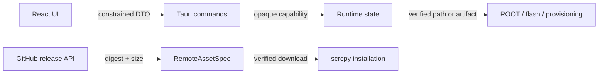

# Rust Remediation Design

**Status:** approved by the user's instruction to repair every confirmed finding; serial binding is intentionally prohibited because each launch operates on one device.

## Scope

This remediation changes only the Rust/Tauri desktop implementation and its React IPC DTO types. It does not modify `cloudflare/**`, add VMP protection, or add any serial binding. The application is intentionally operated against one device per launch; serial is a transient Rust command argument derived from the current device snapshot when needed.

## Problem Statement

The audit found two classes of defects:

1. Destructive or credential-bearing IPC commands accept data that should remain Rust-owned.
2. Resource provisioning and process execution trust incomplete state: a temporary directory is removed before publication, corrupt resources do not self-heal, and child-process pipes are not drained until process exit.

The ROOT image selector also records a mutable pathname without binding later work to the inspected bytes.

## Chosen Design

### Command boundary

The public Tauri handler exposes only user-visible, constrained workflows. The unused raw quick-flash plan executor, generic firmware URL resolver, and generic remote-payload inspector are removed from the handler. Their Rust-internal helpers remain callable only by constrained command implementations. Login returns identity display data only; the bearer token remains in `AppState.session_token`.

This is preferred to validating each field of arbitrary IPC plans because safe plans are already constructed from `DeviceRuntime`, opaque artifact runtimes, and native file dialogs. A raw plan is inherently outside that capability model.

### scrcpy provisioning

The release manifest is requested only from GitHub's official API. The selected Windows asset must carry a valid GitHub `sha256:<hex>` digest and size. The downloader may use its existing mirror transport only after those values are pinned in `RemoteAssetSpec`; a mirror cannot choose both the digest and the executable. Publication copies the staged payload before staging cleanup and removes temporary data on every exit path.

### Resource recovery

ROOT manager APK selection checks structural and hash validity before preferring the bundled copy. A valid cache wins over an invalid bundled copy. The payload dumper verifies bundled and cached executables before reporting availability; a corrupt cached executable is removed before a fresh verified install.

### Process execution

Immediately after spawning, stdout and stderr pipes are drained by reader threads while the parent retains polling, timeout, and process-tree cancellation. This preserves cancellation semantics and eliminates pipe-buffer deadlocks. Reader failures surface as external-tool errors only after the child is reaped.

### ROOT selection integrity

The native selector computes a SHA-256 fingerprint alongside `FlashImageInfo`. The runtime stores it privately and recomputes it before preflight, patching, and automatic workflows consume the selection. A changed path is rejected with a reselect message. Test-only unverified runtime fixtures remain possible only inside the Rust unit module; production selection always has a fingerprint.

## Data Flow

## Acceptance Criteria

- No public handler accepts a raw `PartitionExecutionPlan`, arbitrary ROM URL, or returns a bearer token.
- A staged scrcpy payload is published before cleanup; a missing or malformed release digest fails closed.
- A corrupt bundled ROOT APK falls back to a valid cache, and a corrupt payload cache self-heals.
- Large child stdout/stderr does not cause the process runner to time out or hang.
- Changing a selected ROOT image before use makes the workflow reject the selection.
- Rust workspace tests pass; `cargo fmt --check` and strict Clippy are clean.
